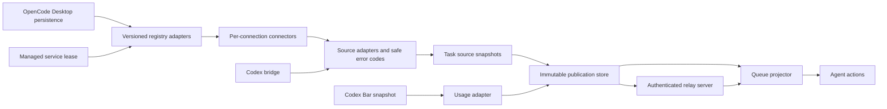
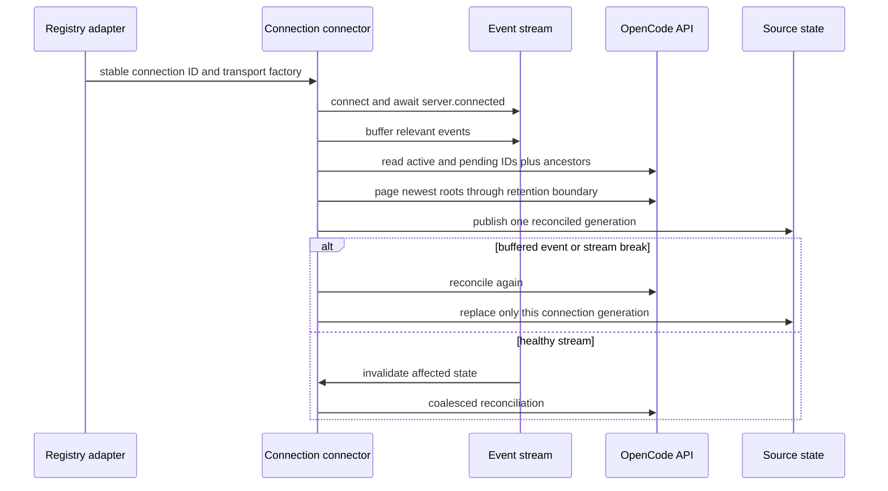
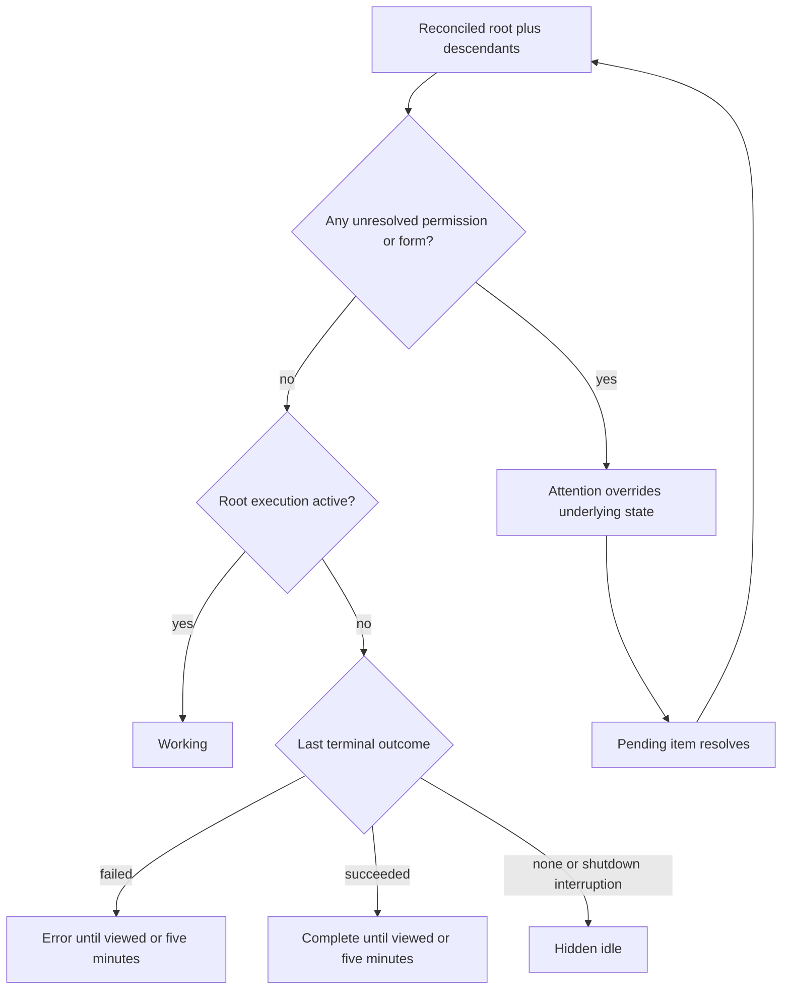
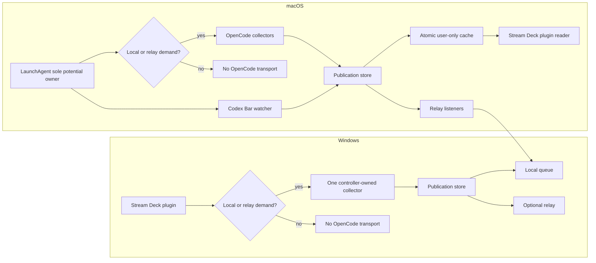
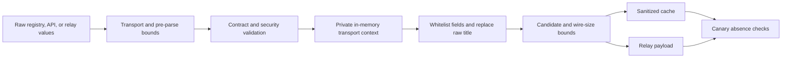
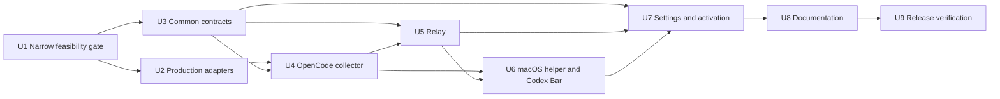

# Unified Codex and OpenCode Queue - Plan

## 2026-09-18 scope amendment (authoritative)

The maintainer confirmed that the release needs only the currently characterized
macOS setup: OpenCode Desktop `2.0.5`, its managed local `sidecar`, and saved SSH
connections. This amendment supersedes every broader requirement below. The
original plan is retained after this section as historical design material for a
possible future expansion; it is not a release gate for the scoped work.

The operative scope is:

- keep the six Agent actions and add global `Codex`, `OpenCode`, and `Both`
  selection;
- force the existing Active queue for `OpenCode` and `Both`, with one neutral
  ranking and content-free `OpenCode N` labels;
- collect the local sidecar and saved SSH connections independently, without
  launching a stopped local or remote service;
- start the collector only while local settings select `OpenCode` or `Both`, and
  tear down all SSH process groups when demand ends;
- read macOS quota windows only from a fresh CodexBar widget snapshot; retain the
  existing Windows usage and reset behavior;
- preserve all existing Windows-only, macOS-only, Codex relay, and iOS behavior.

Explicitly excluded from this release are WSL, saved HTTP connections, renderer
SQLite/WAL, native SQLite dependencies, OpenCode relay extensions, Windows
OpenCode collection, helper/cache ownership, and iOS OpenCode display. Therefore
the earlier U1 SQLite/WSL `no-go` receipt no longer blocks this scoped
implementation. These exclusions must fail closed rather than silently falling
back to process memory, Chromium storage, logs, hotkeys, or task databases.

## Original broad plan (non-operative after the amendment)

## Goal Capsule

- **Objective:** Add OpenCode Desktop sessions to the existing Agent queue, let the user choose `Codex`, `OpenCode`, or `Both`, and read macOS Codex limits from Codex Bar without requiring Codex Desktop to run.
- **Authority:** The decisions recorded in this plan extend `docs/plans/2026-08-11-001-active-agent-queue-plan.md` and preserve the working-order correction in `docs/plans/2026-08-11-002-fix-stable-active-queue-order-plan.md`.
- **Execution profile:** Deep, test-first, cross-platform integration work across private local contracts, task projection, relay protocol, macOS helper lifecycle, settings, rendering, documentation, and release packaging.
- **Hard gate:** Before broad implementation, prove the current managed `sidecar` and saved SSH connection, saved-HTTP policy, ready-WSL no-launch rule, live SQLite/WAL read, and packaged native addon without reading process memory, exposing credentials, causing hidden writes, or depending on an interactive prompt. If any required path cannot satisfy the gate, stop and return the blocker instead of silently reducing connection coverage.
- **Stop conditions:** Stop if the work requires exposing a Chrome DevTools endpoint, forwarding OpenCode API ports over the Codex Deck relay, persisting OpenCode credentials outside their existing stores, scraping process memory or logs, exposing a raw Desktop server key as connection identity, adding a task-database or hotkey fallback to the Codex bridge, weakening relay authentication, or relying on a private session deep link.
- **Tail ownership:** Implementation owns automated checks, local builds, compatibility notes, release-artifact audit, and explicit reporting of live-app and physical-device evidence. It does not claim unperformed Windows, multi-host, iOS-device, or Stream Deck hardware testing.

## Product Contract

### Summary

Codex Deck gains one global task-source selector for every Agent action. `Codex` preserves today's behavior after upgrade. `OpenCode` and `Both` use the existing Active queue semantics across every configured Agent button, with Codex and OpenCode competing in one source-neutral ranking.

While OpenCode monitoring is demanded, data is collected independently for every connection known to OpenCode Desktop. A failed connection degrades only itself. Pressing an OpenCode task activates OpenCode Desktop on the host that owns the connection; this release does not answer permissions, submit forms, control the task, or navigate to the exact session.

On macOS, usage windows come only from Codex Bar's `widget-snapshot.json`. Missing, malformed, or stale Codex Bar data makes usage unavailable and never launches Codex Desktop. Windows retains the existing Codex Desktop usage path.

### Requirements

#### Source selection and queue behavior

- **R1:** Add one global task-source setting with exact values `Codex`, `OpenCode`, and `Both`; an absent or invalid value resolves to `Codex` so upgrades do not change existing decks.
- **R2:** Apply the selected source to all existing Agent actions without imposing a four-button limit; the implementation continues to support all six action identifiers even when the current layout contains four.
- **R3:** `OpenCode` and `Both` always use the Active queue because OpenCode has no fixed native-slot equivalent. Preserve the user's stored Active queue preference and restore it when the source returns to `Codex`.
- **R4:** Rank both sources in one queue: attention or error first, completed and unread second, working third. Hide idle tasks and render unused healthy positions black.
- **R5:** Keep a successful or failed terminal task until its source reports it viewed or five minutes have elapsed on the collector's local clock since the normalized terminal event. Bind the deadline to the execution revision so refresh, reconnect, cache replay, or remote clock skew cannot extend it. An unresolved permission or form remains attention-worthy without that timeout.
- **R6:** Move a working task only after a new trusted user-started root execution. Opening, selecting, refreshing, reconnecting, child execution, background execution, or a generic status change must not reorder it.
- **R7:** Apply the six-position projection only after source filtering, cross-host merging, source-neutral ranking, and per-source freshness checks.

#### OpenCode discovery and normalization

- **R8:** Collect sessions from every connection represented by OpenCode Desktop: managed local `sidecar`, saved HTTP, saved SSH, and already-ready WSL where applicable. Do not start a WSL distribution merely to monitor it.
- **R9:** Isolate discovery, transport, snapshot, health, retry, and last-good data by connection. Failure or schema drift in one connection must not erase or relabel healthy connections.
- **R10:** Define OpenCode task identity as the byte-preserving tuple `(controlHostId, connectionId, sessionId)`. When Desktop supplies an opaque stable ID, use it; otherwise derive `connectionId` as a host-namespaced opaque digest of Desktop's exact stable server key inside the registry adapter. Never publish or compare by the raw URL, distro, SSH target, label, port, or process ID outside that adapter. Render a stable first-seen `OpenCode N` alias for each visible task identity.
- **R11:** Normalize an unresolved permission or form in a root session or descendant to attention; an active root execution to working; terminal success to complete; terminal failure to error; and all other states to hidden idle. Attention takes precedence over working or terminal state.
- **R12:** Bootstrap each connection from active and pending IDs plus their ancestor chains, then page root sessions newest-first only through the terminal-retention boundary. Use events for prompt invalidation, never as the only source of truth, and repeat the queue-relevant reconciliation after event-stream interruption.
- **R13:** Treat OpenCode V2, the Desktop registry, service registration, settings, and renderer database as versioned private contracts. Decide compatibility by validated shape and capabilities, not exact version string: an unknown version matching a characterized profile remains available with diagnostic `uncharacterized-compatible` health; an incompatible shape fails only that connection closed.
- **R14:** Bound response bytes, pages, records, event buffers, field lengths, reconciliation time, and the final candidate set per connection, with thresholds measured and fixed by U1. When older history or the relevant candidate set exceeds a bound, publish the largest deterministic prefix in queue order—attention/error, unviewed completion, then working—with `complete: false` and source health `capacity-exceeded`. Never let one source consume another source's reserved aggregate budget; an unsafe current-state read degrades only that connection without publication.

#### Activation and host ownership

- **R15:** Capture the displayed assignment on key-down. An OpenCode assignment activates or launches OpenCode Desktop once on key-down and performs no action on key-up.
- **R16:** Activate OpenCode Desktop on `controlHostId`, including for SSH and WSL connections; never target the remote SSH machine or WSL guest as the UI owner.
- **R17:** Preserve the existing Codex down/up command pair even if the queue or source setting changes while the key is held.
- **R18:** If OpenCode Desktop is not installed or cannot be activated, show the existing alert treatment without falling back to a deep link, terminal client, hotkey, or task action.

#### Usage and relay

- **R19:** On macOS, read Codex quota windows only from the newest valid release Codex Bar snapshot and project only remaining/used percentages, reset times, and observation time. The narrow reset-credit exception is defined separately in R22.
- **R20:** Treat an absent, malformed, unsupported, future-dated, or stale Codex Bar provider entry as unavailable. Retain the last valid value only for diagnosis, not for display after its freshness window.
- **R21:** Do not launch or connect to Codex Desktop to obtain usage on macOS. Keep the existing Windows Codex Desktop usage path unchanged.
- **R22:** Keep `Rate Limit Reset` on its existing Codex route. On macOS, its optional credit/applicability preflight may come only from an already-attached Codex bridge and stays separate from Codex Bar quota display; the action never starts or reconnects Codex merely to obtain reset state.
- **R23:** Publish sanitized OpenCode candidates and source health through an additive protocol-v1 extension that older peers can ignore. Publish normalized Codex Bar quota windows through the existing legacy `MicroSnapshot.usage` field so unchanged Windows and iOS clients retain usage display. OpenCode and usage publication must continue when the Codex bridge is degraded. Existing relay configurations remain Codex-only; enabling OpenCode relay explicitly rotates the token and authorizes the new data and foreground capability for that listener and token generation.
- **R24:** Preserve Windows-only, macOS-only, and optional multi-host operation. Start OpenCode discovery and transports only while the local setting selects `OpenCode`/`Both` or an authenticated, OpenCode-authorized relay consumer holds a live source subscription; stop them after the final demand lease expires. A demanded host publishes every locally available OpenCode connection regardless of which connection contributes visible tasks.
- **R25:** Preserve old iOS decoding and existing Codex mobile behavior. New OpenCode display and activation in the iOS app are not required in this release.

#### Security and privacy

- **R26:** Keep credentials only inside a short-lived local transport context. Never include passwords, authorization headers, service registrations, endpoint URLs, SSH targets, raw OpenCode titles, private paths, form fields, permission resources, messages, costs, token counts, billing/account-credit balances, or daily history in task snapshots, caches, relay payloads, logs, fixtures, diagnostics, or release artifacts. OpenCode uses a bounded non-content display label. Existing bounded reset-credit availability/applicability counters may remain only in legacy Codex usage when supplied by an already-attached Codex bridge.
- **R27:** Validate every private file through descriptor-bound checks: no symlink or reparse point, trusted owner and ancestors, user-only access, bounded size, stable file identity, and generation-safe rotation. Managed service endpoints additionally require canonical loopback origin and an authenticated capability probe.
- **R28:** Read Desktop persistence through strict whitelists and read-only access. Unknown extra fields remain forward-compatible; a known field with an invalid type fails only the affected source. Saved HTTP allows literal loopback `http:` or validated `https:` only, rejects URL userinfo and redirects, and never forwards auth across origins or through a proxy.
- **R29:** Raw exceptions and subprocess output remain inside their adapter. Convert them to a closed set of safe error codes before cache, relay, UI, or logging; apply sink-level redaction as defense in depth and prove absence with seeded canaries.

### Acceptance Scenarios

- **A1 — Upgrade safety:** Existing settings lack `taskSource`; after upgrade all Agent actions still show and control Codex exactly as before.
- **A2 — Mixed queue:** With one Codex approval, one OpenCode error, one Codex completion, one OpenCode completion, and two working tasks, all six positions follow the common priority and stable-working rules without source preference.
- **A3 — Partial failure:** Saved SSH is unavailable while sidecar and saved HTTP are healthy; their tasks remain visible, SSH retains independent degraded health, and no global empty state appears.
- **A4 — Identity isolation:** Two connections report the same `sessionId`; they remain separate assignments and activation still targets their owning host.
- **A5 — Terminal retention:** An OpenCode run completes. It disappears immediately when `viewed >= idle`, otherwise at the five-minute boundary, and reconnecting does not extend the boundary.
- **A6 — Stable work order:** A child run and ordinary session update do not move a working root task. A later trusted root `session.execution.started` event does.
- **A7 — Foreground only:** Pressing an OpenCode assignment brings the owning Desktop app forward or starts it; no API mutation, form response, permission reply, TUI, or session route is invoked.
- **A8 — macOS without Codex:** Codex Desktop is stopped, Codex Bar has a fresh snapshot, and usage renders while demanded OpenCode collection and relay remain operational.
- **A9 — Stale usage:** Codex Bar is absent or stale; usage shows unavailable, OpenCode tasks remain healthy, and neither Codex nor Codex Bar is launched.
- **A10 — Relay compatibility:** A new server and old client continue exchanging the required legacy Codex snapshot and usage. A Codex-only or unsubscribed socket receives no OpenCode fields or commands even while another subscriber or local demand is active. A reauthorized and subscribed client consumes the optional task-source extension; one oversized connection does not suppress another.
- **A11 — Secret boundary:** An OpenCode title and every raw error surface are seeded with credential, endpoint, SSH-target, and private-path canaries. Sanitized snapshots, helper cache, relay frames, logs, test fixtures, source maps, native addons, and packaged artifacts contain none of them.
- **A12 — Distinguishable private labels:** Two same-host, same-connection, same-status OpenCode tasks render as stable `OpenCode N` aliases that remain bound to their identities across refresh and reorder without revealing titles or server keys.
- **A13 — Opt-in monitoring:** An upgraded `Codex`-only host with no reauthorized relay subscriber opens no OpenCode database, HTTP, SSH, or WSL transport. Selecting `OpenCode` or receiving an authorized subscription starts one collector demand and releasing the last demand tears it down.

### Key Product Decisions

- **KD1 — One global selector (Governs R1-R3):** Source selection is global, not configured per button.
- **KD2 — One neutral queue (Governs R4-R7):** Codex and OpenCode share ranking; neither source receives priority.
- **KD3 — Desktop foreground only (Governs R15-R18):** OpenCode activation stops at the app boundary until an official stable open-session action exists.
- **KD4 — Codex Bar is the macOS quota source (Governs R19-R22):** macOS quota display does not depend on Codex Desktop.
- **KD5 — Every Desktop connection, isolated failures (Governs R8-R14):** Connection coverage is broad, but one broken private contract cannot poison the other connections.
- **KD6 — Preserve host independence (Governs R23-R25):** The relay is optional transport, not a prerequisite for either local platform.

## Scope Boundaries

### In Scope

- Global source setting and property-inspector behavior.
- Source-neutral task model, queue ranking, rendering, and key assignment.
- Read-only OpenCode Desktop registry and OpenCode V2 session collection for sidecar, saved HTTP, saved SSH, and ready WSL.
- Per-connection health, reconciliation, retry, freshness, and bounded cache.
- OpenCode Desktop foreground activation on macOS and Windows.
- Codex Bar snapshot resolution, parsing, freshness, and directory watching on macOS.
- Additive relay transport and backward-compatible Swift decoding.
- Setup, architecture, compatibility, security, and troubleshooting documentation.

### Deferred to Follow-Up Work

- Exact navigation to an existing OpenCode session after an official stable `open-session` mechanism exists.
- Permission and form responses, interrupt/resume, prompting, session creation, or any other OpenCode mutation.
- Native OpenCode task display or activation in the iOS app.
- Official support promises for unknown future OpenCode Desktop persistence profiles before they are characterized; a version whose validated shape still matches a known profile may run as `uncharacterized-compatible`.

### Out of Scope

- Rebinding, exposing, or forwarding Codex Chrome DevTools.
- OpenCode permission automation or private deep-link automation.
- Starting dormant WSL distributions solely for monitoring.
- Changing the behavior or availability contract of `Rate Limit Reset`.
- Copying proprietary Codex, OpenCode, OpenAI, or Elgato assets or runtime data into the repository or release.

## Assumptions

- The currently saved SSH connection can authenticate non-interactively through the user's existing SSH configuration or can be reached through a supported OpenCode Desktop broker. U1 must validate this assumption before the release proceeds; failure records `no-go` and stops the release.
- OpenCode errors use the same viewed-or-five-minute retention rule as successful completions.
- The macOS Codex Bar freshness window is five minutes, which tolerates the selected two-minute refresh cadence while failing visibly after missed refreshes. Make the constant named and fixture-tested rather than user-configurable in this release.
- The OpenCode connection label is optional display metadata only; task identity and queue rank never depend on it.
- OpenCode monitoring is opt-in through local source selection or an explicitly OpenCode-authorized relay subscription; a default `Codex` upgrade with no subscribed peer opens no OpenCode database, HTTP, SSH, or WSL transport.

## Planning Contract

### Threat Model

- Protect credentials and private content from other local users, relay peers, malicious or compromised OpenCode servers, unsafe redirects or DNS resolution, accidental logging, diagnostic export, fixtures, source maps, and release packaging.
- A malicious process already running as the same OS user is outside the confidentiality boundary because it can read the same Desktop stores. The design still denies it convenient persistence or propagation by keeping secrets out of command arguments, inherited environment, cache, relay, logs, diagnostics, and artifacts.
- Treat every private file, network response, SSE event, SQLite row, saved URL, subprocess field, upstream title, and relay frame received from an authenticated peer as untrusted input. Trust is granted only after descriptor-bound file checks, transport policy, strict projection, bounds, and generation checks.
- Relay authentication authorizes only the existing typed protocol. It never authorizes raw OpenCode API access, endpoint disclosure, or credential forwarding.

### Key Technical Decisions

- **KTD1 — Put private contracts behind versioned adapters and safe error codes.** Use separate adapters for managed service registration, Desktop persistence, SSH/WSL transport, OpenCode HTTP/SSE, and Codex Bar. Each adapter converts `unknown` input to a minimal internal DTO and a closed error code; raw input, exceptions, and subprocess output never cross the adapter. This contains patch-version drift such as the OpenCode `server.status` to `server.info` change. Covers R8-R14, R19-R20, R26-R29.
- **KTD2 — Use a feasibility gate for SSH/WSL instead of a secret-extraction fallback.** Reproduce only safe Desktop behavior with absolute allowlisted executables, no shell, typed arguments, minimal environment, closed stdin, non-interactive authentication, host-key verification, loopback-only forwarding, bounded redacted output, and process-group teardown. Before sending credentials, prove the expected generation-owned child controls the listener and that unauthenticated requests are rejected; a hostile pre-bind must receive zero credential bytes. Keep returned credentials in memory and tear them down with the connector generation. If that cannot cover the current saved connection or guarantee that ready-WSL attachment will not start a stopped guest, stop the release. Covers R8, R13, R26-R29.
- **KTD3 — Reconcile queue-relevant snapshots; let SSE invalidate within a fair budget.** For each connection, open the event stream, buffer after `server.connected`, load active and pending IDs with ancestor chains, and page roots newest-first through the terminal-retention boundary. Reconcile again if events arrived during bootstrap, then use events to schedule coalesced reconciliation. Repeat that bounded bootstrap after every disconnect because public SSE has no replay guarantee. Enforce per-connection event rate and reconciliation duty-cycle budgets plus fair global concurrency; exhaustion closes only that stream and enters bounded backoff. Covers R9, R11-R14.
- **KTD4 — Generalize after Codex ownership resolution, before queue projection.** Keep Codex-specific mirror and ownership logic inside its adapter. At each OpenCode transport boundary, map remote timestamps onto the collector's local observation clock and bind terminal deadline and trusted work-start revision once; reconnect cannot refresh them. Convert resolved Codex candidates and OpenCode roots into one discriminated `AgentTask` containing source reference, opaque identity, stable non-content alias, trusted work-start pair, normalized terminal/viewed timestamps, and control host. Assign each visible OpenCode identity a first-seen ordinal retained for its visible lifetime so same-host tasks remain distinct without raw content. Keep health and reconciliation metadata in a separate `TaskSourceSnapshot` keyed by `sourceInstanceId`; the queue never interprets source-specific identifiers. Covers R4-R7, R9-R12, R26.
- **KTD5 — Separate source health from tasks and host health.** Track Codex, registry, Codex Bar, and every OpenCode connection independently. A selected-source empty state is healthy black only when at least one selected source completed a successful reconciliation; show degradation only when all selected sources are unavailable. Health-only changes do not duplicate every task on the wire. Covers R4, R9, R20, R24.
- **KTD6 — Assign collector ownership by process and demand.** The macOS LaunchAgent is the sole potential owner of discovery, transports, Codex Bar, publication state, and cache writing; the macOS plugin is cache-reader only and supplies a user-only local demand lease when its setting selects OpenCode. The Windows plugin creates one collector only while its local setting or an authorized relay subscription demands it and closes every child after the final demand expires. A nonce- and file-identity-bound owner lease prevents duplicate SSH/WSL transports and is released only by its owner. Covers R8-R9, R19-R24, R26-R29.
- **KTD7 — Extend protocol v1 through per-socket publication and command boundaries.** Split relay publication from command routing: the server subscribes to one immutable publication store and never creates collectors or calls the Codex bridge directly. Bind each authenticated socket to listener configuration, token generation, Codex/OpenCode scope, and subscription state. Retain the required legacy `MicroSnapshot`; project Codex Bar quota windows into its existing `usage`, overlay reset-credit counters only from an already-attached Codex bridge, and add optional bounded `taskSources` plus per-source health. Send those optional fields and advertise/accept `foreground-opencode` only on a currently OpenCode-authorized, subscribed socket. Token rotation immediately invalidates old sockets. Until a real Codex snapshot exists, pair a valid legacy placeholder with legacy degraded health so old clients never infer healthy Codex while still receiving valid legacy usage. Covers R23-R25.
- **KTD8 — Read SQLite with a packaged, side-effect-bounded driver, not shell parsing.** Add a pinned N-API-compatible dependency only after U1 proves the exact OS, architecture, and Node-runtime matrix for the built plugin, release launcher, and installed LaunchAgent. Open through read-only API flags, disable extension loading, use one parameterized allowlisted query, bound busy time and row size, and prove a consistent live DB+WAL snapshot without creating journal/temp files or missing WAL changes. If packaging or live-WAL behavior cannot be deterministic and release-auditable, stop rather than require system tooling or an unsafe parser. Covers R8, R13, R28-R29.
- **KTD9 — Watch the Codex Bar directory and poll as backup.** Resolve known production app-group and fallback paths, select the newest valid Codex provider entry, watch parent directories for atomic replacement, reopen by path after events, debounce bursts, and `stat`/read every 60 seconds to recover missed events. Keep the cadence and five-minute freshness window as named fixture-tested constants. Covers R19-R21.
- **KTD10 — Source selection starts a new queue epoch.** `OpenCode` and `Both` force queue projection while retaining the user's Codex-only Active queue preference. Changing source clears queue-local rank memory after current key-down assignments are captured. Covers R1-R7, R15-R17.
- **KTD11 — Enforce origin policy before credentials exist.** Managed service is canonical literal loopback with proxy bypass. Saved remote HTTP must be `https:` with normal certificate and hostname validation; plain `http:` is allowed only for canonical literal loopback. Reject userinfo, redirects, downgrade, mixed or rebound DNS answers, and any origin change. Authorization is constructed only after this validation and never forwarded. Covers R8, R26-R29.
- **KTD12 — Bind private file validation to the opened object.** Use no-follow/reparse-safe opens followed by `fstat`-equivalent checks of owner, type, link count, size, permissions, ancestors, and file identity. Recheck identity where a library accepts only a path, harden existing state directories, and apply the same primitive to registration, database/WAL, Codex Bar, cache, lease, and logs on macOS and Windows. Covers R19-R20, R26-R29.
- **KTD13 — Derive missing Desktop connection IDs without leaking server keys.** Use Desktop's own stable connection ID where present. For HTTP, WSL, or legacy SSH records without one, derive an opaque HMAC from the exact normalized `ServerConnection.key` with a random user-only stable host secret. Keep both the raw key and secret inside the registry adapter, preserve the opaque result across restarts, and rotate it only when Desktop itself treats the connection as a different server. Covers R8-R10, R26-R28.

### Alternatives Considered

| Alternative | Decision | Reason |
|---|---|---|
| Poll only the managed `sidecar` | Rejected | Violates the all-Desktop-connections requirement. |
| Read renderer LevelDB or process memory | Rejected | Unstable and crosses the credential boundary. |
| Reuse Desktop runtime SSH endpoint by scraping processes | Rejected | Endpoint is insufficient without transient auth and has no stable identity. |
| Require users to duplicate every OpenCode server in Codex Deck settings | Rejected | Creates drift and abandons Desktop as the requested source of truth. |
| Use SSE as the authoritative event log | Rejected | The public feed does not guarantee replay after disconnect. |
| Poll every connection at the existing 1.2-second display cadence | Rejected | Couples rendering to network load and still misses bootstrap races. |
| Put OpenCode into `HostActivityIndex.mergeActiveCatalog` | Rejected | That layer performs Codex-specific UUID mirror and ownership resolution. |
| Give Codex or OpenCode a tie-break preference | Rejected | Contradicts the source-neutral queue decision. |
| Read macOS usage from Codex CLI or Desktop | Rejected | Would require Codex to be present or running. |
| Replace relay protocol v1 | Rejected | An additive field is sufficient and preserves existing peers. |

## High-Level Technical Design

These sketches communicate ownership and sequencing, not exact module names or implementation signatures.

### Component relationships



### Connection bootstrap and recovery



### OpenCode task state projection



### Host collector lifecycle



### Source and queue mode matrix

| Source setting | Stored Active queue | Effective projection | Data collected locally |
|---|---:|---|---|
| `Codex` | off | Existing fixed Codex view | Codex only, unless an authorized relay subscriber demands OpenCode |
| `Codex` | on | Codex Active queue | Codex only, unless an authorized relay subscriber demands OpenCode |
| `OpenCode` | either | OpenCode Active queue | All available local OpenCode connections |
| `Both` | either | Mixed Active queue | Codex plus all available local OpenCode connections |

### Sanitization pipeline



## Implementation Units

### U1 — Prove discovery, transport, and packaging feasibility

**Outcome:** A narrow probe and written `go`/`no-go` receipt resolve every foundational private-contract assumption before production adapters or queue work begin.

**Files:** `package.json`, `package-lock.json`, `.github/workflows/ci.yml`, new bounded probe under `scripts/opencode-feasibility/`, new manually constructed probe fixtures under `test/fixtures/opencode/`, new `docs/OPENCODE_COMPATIBILITY.md`, new `test/opencode-feasibility.test.ts`.

**Work:**

- Probe the current OpenCode Desktop version, service lease, renderer database and live WAL, current saved HTTP policy, saved SSH connection, ready-WSL race, API capabilities, and available stable server keys without committing local values.
- Measure representative and worst observed response bytes, page counts, records, SSE rate/burst, reconciliation duration, field lengths, relevant candidates, and serialized candidate bytes. Record conservative per-connection and aggregate thresholds, including reserved budget for another healthy source and the 64 KiB relay ceiling, as explicit `go`/`no-go` rows.
- Establish one ephemeral sidecar and saved-SSH session-list read with credentials confined to process memory; prove prompt-free cancellation, loopback binding, teardown, and canary absence.
- Evaluate a pinned N-API SQLite candidate with a minimal package/load harness for each proposed OS, architecture, and Node-major tuple, including an installed-helper-shaped location rather than the final release bundle.
- Add the minimal CI matrix needed to execute that probe on every proposed tuple before recording `go`; U2 later integrates the proven artifact into production packaging and release audit.
- Prove ready-WSL attachment cannot start a distribution that stops between discovery and attach. Failure is `no-go`, not reduced support.
- Write exact observations, declared runtime matrix, and `go`/`no-go` criteria to `docs/OPENCODE_COMPATIBILITY.md`. Never include local endpoints, targets, paths, credentials, or unsanitized store extracts.

**Execution note:** Keep the probe deliberately disposable and bounded. Do not build production abstractions in U1. No later unit starts until every hard-gate row records `go`.

**Test scenarios:**

- Read the current sidecar, saved HTTP inventory, and live WAL without filesystem side effects or credential output.
- List sessions through the current saved SSH connection without prompt, raw secret in argv/environment/output, non-loopback bind, or orphan process.
- Pre-bind the expected local port from a hostile second-account fixture; the connector must send zero credential bytes and publish no snapshot until child/generation ownership and endpoint authentication are proved.
- Race ready WSL shutdown against attach and prove the guest remains stopped.
- Derive stable opaque connection IDs for every current connection kind and prove dictionary guesses cannot recover raw Desktop keys without the user-only HMAC secret.
- Load the candidate addon offline for every proposed runtime tuple and reject wrong ABI/architecture, runtime download, fallback compilation, and undeclared Node major.
- Scan probe output and the compatibility receipt as bytes for all canaries before either enters the repository.
- Exercise every proposed threshold at boundary and boundary-plus-one; verify deterministic queue-order truncation, `complete: false`, `capacity-exceeded`, reserved capacity for a second source, and `no-go` when one valid minimum candidate cannot fit.

**Covers:** R8-R10, R13, R26-R29; KTD2, KTD8, KTD11-KTD13.

### U2 — Productionize discovery, transport, and packaging contracts

**Outcome:** After U1 records `go`, reusable adapters and deterministic release packaging implement the proven paths without broadening their authority.

**Files:** `package.json`, `package-lock.json`, `.github/workflows/ci.yml`, `scripts/build.mjs`, `scripts/build-launcher.mjs`, `scripts/audit-release.mjs`, `launcher/start-codex-deck.sh`, `launcher/macos/codex-deck-macos.ts`, new modules under `src/opencode/`, manually constructed fixtures under `test/fixtures/opencode/`, `docs/OPENCODE_COMPATIBILITY.md`, `test/opencode-discovery.test.ts`, `test/release-audit.test.ts`.

**Work:**

- Build strict sidecar, saved-HTTP, SSH, and ready-WSL registry DTOs, KTD13 opaque identity derivation, descriptor-bound safe-file primitives, and adapter-local safe error codes for macOS and Windows.
- Enforce KTD11 before auth and KTD2 for subprocess launch. Treat runtime endpoints, stable raw server keys, and credentials as transport-only values.
- Package the pinned SQLite addon for the declared matrix with deterministic placement, provenance, hashes, licenses, offline install, and no runtime download or fallback compilation. Make launcher/runtime selection fail closed outside declared Node majors.
- Implement the proven live-WAL read through read-only API flags, disabled extension loading, a fixed parameterized query, bounded busy time/row size, and explicit filesystem-effect checks.
- Record only manually constructed fixtures for every shape characterized by U1, including the researched `2.0.5`/`2.0.6` shapes where still applicable; never derive repository fixtures directly from a live store.
- Extend CI and release audit to load the addon from built plugin, release launcher, and installed LaunchAgent-shaped output for every declared target and to scan every file as bytes.

**Test scenarios:**

- Reject symlink/reparse, hard-link, wrong owner, broad permissions, unsafe ancestors, oversized files, non-loopback sidecar, bad auth, PID mismatch, stale generation, and file replacement races.
- Reject saved HTTP userinfo, redirect, cross-origin auth, downgrade, proxy use for loopback, DNS rebinding or mixed answers, invalid certificates, and non-loopback plain HTTP.
- Rotate a lease during bootstrap; late old-generation responses cannot publish.
- Start and tear down SSH without shell, persistence, inherited secret environment, or prompt; test option injection, host-key and bind failure, crash cleanup, and password-only no-go behavior.
- Load installed native output for every declared tuple and reject undeclared Node major, wrong ABI/architecture, tampered hash, unexpected binary, network download, fallback compilation, or addon lookup outside the package.
- Prove release audit catches canaries and absolute build paths in text, source maps, archives, and native binaries.

**Covers:** R8-R10, R13-R14, R26-R29; KTD1-KTD2, KTD8, KTD11-KTD13.

### U3 — Introduce source-neutral task and health contracts

**Outcome:** Codex and OpenCode can be represented without leaking source-specific identity or health assumptions into the queue.

**Files:** `src/types.ts`, `src/status.ts`, `src/active-queue.ts`, `src/relay-protocol.ts`, `test/active-queue.test.ts`, `test/status.test.ts`, `test/relay.test.ts`.

**Work:**

- Add a discriminated task model for Codex and OpenCode with opaque identity, `sourceInstanceId`, control host, bounded non-content display label, normalized status, trusted work-start pair, and terminal/viewed time.
- Add a separate source snapshot with host/source kind, generation, reconciliation timestamps, health/error code, bounds metadata, and tasks. Pass a separate health map to the queue projector.
- Adapt resolved Codex candidates after existing mirror/ownership logic; do not alter native fixed-slot behavior when source is `Codex` and Active queue is off.
- Remove status-transition inferred promotion from working rank. Seed cold-start tasks in stable first-observed order and promote only a newer trusted root-start revision.
- Project completion and error expiry directly from terminal/viewed timestamps rather than extending it on refresh.
- Define independent health aggregation and healthy-black versus all-selected-sources-degraded behavior.

**Execution note:** Preserve the prior Active queue tests as characterization before changing the common projector.

**Test scenarios:**

- Rank mixed attention, error, completion, and working tasks without a source tie-break.
- Keep equal OpenCode session IDs from two connections distinct and preserve case in opaque IDs.
- Keep KTD13-derived connection IDs stable across restart and distinct across raw Desktop keys without exposing those keys.
- Hold working positions through refresh, selection, child activity, reconnect, and status-only transitions; promote only a newer root-start revision.
- Hide viewed and expired terminal tasks at exact boundaries and retain unresolved attention indefinitely.
- Apply source filtering before the six-item slice and support 1, 4, and 6 Agent actions with black healthy gaps.
- Keep healthy source tasks visible when another source or connection is degraded; show degradation only when every selected source is unavailable.
- Seed an OpenCode title with credential and path canaries; only the non-content label may reach rendering, cache, relay, logs, or artifacts.

**Covers:** R1-R7, R9-R12, R26; KTD4-KTD5, KTD10.

### U4 — Build the multi-connection OpenCode collector

**Outcome:** Every supported Desktop connection produces an independently reconciled, bounded, secret-free task snapshot.

**Files:** new modules under `src/opencode/`, `src/codex-deck-paths.ts`, `test/opencode-collector.test.ts`, `test/opencode-discovery.test.ts`.

**Work:**

- Implement the connection lifecycle around the U2 production adapters with independent generation, cancellation, backoff, last successful sync, stale deadline, and structured error code.
- Bootstrap with event buffering, active and pending IDs, ancestor-chain reads, and newest-first root pages through the retention boundary. Build only the queue-relevant parent/child relationships before root-state projection.
- Reconcile on relevant execution, permission, form, and session events; coalesce bursts and repeat the bounded queue-relevant bootstrap after stream loss.
- Enforce per-connection invalidation rate and reconciliation duty-cycle budgets plus fair global concurrency. Exhaustion closes only that stream, marks its source degraded, and enters bounded backoff before bootstrap.
- Recover trusted root-start revision from durable per-session log only where the characterized capability supports it. Otherwise preserve stable fallback order rather than infer recency.
- Enforce characterized decompressed response, page, item, cursor-chain, SQLite row, ID, SSE event, buffered-event, reconciliation-time, candidate, and byte limits before expensive parsing or aggregation. Publish known active/pending/retained tasks with `complete: false` when older history truncates; mark only an unsafe current-state read as degraded.
- If relevant candidates exceed the per-source or aggregate reservation, sort with the common queue comparator, publish the largest fitting prefix, and set `complete: false` plus `capacity-exceeded`; never evict another source's reserved budget. If current active/pending state itself cannot be read safely, publish no new generation for that source and retain only its bounded stale policy.
- Produce a versioned source snapshot and cache DTO with writer generation, last-attempt and last-success times, explicit completeness, and declared fields only.
- Acquire an atomic collector lease bound to a random nonce and file identity for the entire owner lifetime. Reclaim and release only when identity and nonce still match; never recursively remove a path that may have been replaced.

**Execution note:** Use deterministic fake clocks, fake HTTP/SSE transports, and process fakes; live OpenCode checks are separate evidence.

**Test scenarios:**

- Page beyond 50 sessions, handle empty, duplicate, and never-ending unique cursors safely, reject oversized compressed/body/event input, and project only queue-relevant roots.
- Receive an event during bootstrap, reconcile before `synced`, then recover after disconnect without duplicate tasks or rank changes.
- Normalize ahead/behind remote clocks at the transport boundary, bind terminal deadline and work-start revision once, and prove reconnect or cache replay does not extend either.
- Aggregate descendant permission/form attention into the root while excluding form fields, resources, directories, messages, model, token, and cost data.
- Prioritize attention over active/terminal state and handle shutdown interruption as non-terminal idle recovery.
- Fail connection A while B remains healthy; retain A only within its stale grace and never refresh terminal expiry from the failure.
- Reject late old-generation responses after lease rotation and cleanly terminate SSH/WSL child processes.
- Overflow one connection's candidate bound while another still publishes within relay limits.
- At every measured boundary and boundary-plus-one, preserve the deterministic attention/error → completion → working prefix, report `capacity-exceeded`, and leave the second connection's reserved budget intact.
- Sustain a stream of small valid events from connection A; it exhausts only A's duty-cycle budget while connection B stays fresh and relay publication remains responsive.
- Race two owners, PID reuse, crash-before-owner-record, concurrent stale reclaim, and lock-path replacement; at most one may open an SSH/WSL transport.
- Reject stale, wrong-owner, symlink/reparse, broad-permission, oversized, unknown-field, or old-writer cache input; a writer takeover cannot publish an earlier generation.

**Covers:** R8-R14, R26-R29; KTD1-KTD3, KTD5-KTD6, KTD11-KTD12.

### U5 — Extend relay and preserve cross-version clients

**Outcome:** Sanitized source tasks and usage cross the existing authenticated relay without coupling to Codex bridge health or breaking old peers.

**Files:** `src/relay-protocol.ts`, `src/codex-relay-server.ts`, `src/codex-relay-client.ts`, `src/controller.ts`, `src/relay-network.ts`, `launcher/macos/codex-deck-macos.ts`, `launcher/Configure-CodexDeckRelay.ps1`, `test/relay.test.ts`, `test/macos-launcher.test.ts`, `ios/CodexDeckMobileTests/MobileMergeTests.swift`.

**Work:**

- Introduce an immutable publication store and a separate typed command router. `CodexRelayServer` subscribes, bounds, encodes, and sends; it never owns collectors or directly refreshes `CodexMicroRendererBridge`.
- Share one publication-store instance across ordinary and Nearby relay listeners so additional listeners never duplicate OpenCode connections or child processes.
- Add optional bounded source-task and health sections plus capabilities for source data and OpenCode foreground activation while retaining protocol version 1 and required legacy fields.
- On receipt, project authenticated peer frames through the same strict DTO, per-source count/byte limits, ID checks, and display-label length/character policy used for local publication; authentication alone does not make payload fields trusted.
- Normalize sender timestamps at receipt for terminal expiry and trusted starts without trusting cross-host clocks.
- Let the store publish source extension, source health, and usage generations independently from Codex snapshots and health.
- Add an authenticated source-subscription message with disconnect/TTL cleanup. Extend the macOS relay setup with an explicit OpenCode authorization flag that sets `allowOpenCode`, increments the listener token generation, rotates the server token, closes older-generation sockets, and emits fresh client configuration; extend the Windows configurator with an explicit `requestOpenCode` opt-in. Bind authorization and subscription to the individual socket, send a subscription only after the server advertises the capability and both sides opt in, and filter every outgoing frame and command by that socket's scope. Existing tokens/configurations remain Codex-only.
- Compose legacy usage independently from source extensions: Codex Bar provides macOS quota windows and reset times; an already-attached Codex bridge may overlay only `resetCreditsAvailable` and `resetCreditsApplicable`; Windows retains its complete current bridge-derived usage. Never launch or attach Codex for the overlay.
- Define an optional `foreground-opencode` handler, route only to the owning authenticated host, and reject unsupported capability without falling back to a Codex command. Advertise and accept it only when the platform handler exists and that specific socket has current OpenCode scope plus subscription. U7 installs the platform handler.
- Keep production Swift models and merge behavior unchanged; prove their keyed decoding ignores the additive root fields.

**Test scenarios:**

- Decode new server frames with an old-client fixture and old server frames with the new client.
- Continue source publication with a degraded or never-attached Codex bridge using a valid legacy placeholder immediately followed by legacy degraded health; subsequent source-only updates must not leave old clients in a false-ready state.
- Normalize remote terminal and work-start times once at receipt, preserving five-minute expiry and revision ordering.
- Reject malformed IDs, unknown commands, missing capabilities, oversized frames, and a foreground command sent to the wrong host.
- Reject an authenticated peer frame with an overlong or invalid label, excessive per-source tasks, or an inconsistent completeness/generation tuple before it reaches queue, cache, or rendering; ignore unknown additive fields.
- Keep OpenCode collection stopped for an old token or unsubscribed peer; after explicit token rotation and subscription, start one demand lease and stop it after disconnect/TTL.
- With local demand already collecting tasks, prove a Codex-only socket and an OpenCode-authorized-but-unsubscribed socket receive no `taskSources` and cannot invoke `foreground-opencode`; a subscribed socket can do both. Rotation immediately disconnects and invalidates the old generation.
- Preserve one healthy connection when another exceeds its bound; keep total frames below 64 KiB with a deterministic truncation order and explicit per-source completeness.
- Prove relay frames contain no endpoint, credential, SSH target, private path, permission/form payload, cost, token, or history fields.
- Exercise authenticate → placeholder/source update → legacy degraded health → later source update against old- and new-client state machines.
- Decode the extended frame with the unchanged Swift model and preserve the current Codex-only mobile merge result.
- For macOS Codex detached/attached and fresh/stale Codex Bar combinations, verify unchanged Swift and Windows clients receive legacy quota windows correctly, reset-credit counters appear only from an attached bridge, remote reset never launches Codex, and stale quota becomes unavailable without erasing valid bridge reset metadata.

**Covers:** R23-R29; KTD5-KTD7.

### U6 — Decouple the macOS helper and add Codex Bar usage

**Outcome:** The macOS LaunchAgent is the sole local collector owner, feeds the U5 publication store, and writes a sanitized cache whether or not Codex Desktop is installed or running.

**Files:** `launcher/macos/codex-deck-macos.ts`, `launcher/macos/watcher-policy.ts`, `launcher/start-codex-deck.sh`, `src/usage.ts`, `src/codex-deck-paths.ts`, `scripts/build-launcher.mjs`, `test/macos-launcher.test.ts`, `test/macos-watcher.test.ts`, `test/usage.test.ts`.

**Work:**

- Split helper startup from Codex installation discovery. Codex bridge attachment becomes one optional source lifecycle, not the supervisor or relay-server lifecycle.
- Acquire the hardened U4 owner lease and, while demand exists, run one collector, feed the shared publication store, and atomically write the versioned user-only cache. Harden existing state, log, cache, and lease directories before use.
- Start the collector only while a local plugin demand lease or authenticated relay subscription exists; expire abandoned demand and tear down all source transports without stopping Codex Bar usage publication.
- Make the macOS plugin cache-reader only; it never acquires the lease or opens OpenCode, SSH, WSL, SQLite, or Codex Bar transports.
- Resolve current production app-group, legacy release app-group, and documented Application Support fallback; exclude debug containers and use KTD12 for every read.
- Parse Codex provider `usageRows` from `unknown`, accept unknown additive fields, reject invalid known fields, and choose the newest valid provider entry.
- Project only Codex Bar quota windows and reset times into the existing legacy usage shape. Overlay `resetCreditsAvailable` and `resetCreditsApplicable` only from an already-attached Codex bridge; do not map Codex Bar billing/account credits.
- Watch parent directories for atomic replacement, reopen and revalidate the path, debounce bursts, and add periodic read recovery. Enforce the five-minute provider freshness window and clock-skew guard.
- Prevent usage refresh from triggering Codex recovery or launch.
- Keep optional reset-credit preflight separate from displayed usage: read it only from an already-attached Codex bridge when the reset action needs it, and never attach or launch Codex for that preflight.

**Test scenarios:**

- Start helper with Codex absent and an active OpenCode demand lease; still publish OpenCode/cache/relay data through U5.
- Attach and detach Codex later without restarting, clearing independent sources, or replacing the publication store.
- Reload the macOS plugin and prove it reads cache without opening a transport; stale cache becomes unavailable.
- Select the newest valid Codex Bar production snapshot across known paths; ignore debug paths and unrelated providers.
- Recover from atomic rename, missed watcher event, transient `ENOENT`, truncated JSON, unknown fields, legacy optional omissions, and path replacement races.
- Harden broad permissions on existing state/log directories and reject symlink/reparse or wrong-owner paths.
- Mark usage unavailable at the freshness boundary and for future-dated data while leaving OpenCode healthy.
- With Codex detached, reset reports unavailable without launching it; with an already-attached bridge, reset uses its current credit/applicability state while displayed quota still comes from Codex Bar.
- Prove costs, token details, daily history, billing/account credits, and source path do not enter normalized usage, cache, logs, or relay; the only allowed credit fields are bounded reset availability/applicability counters from an already-attached bridge.

**Covers:** R19-R24, R26-R29; KTD1, KTD5-KTD7, KTD9, KTD12.

### U7 — Wire settings, rendering, and source-aware activation

**Outcome:** Users can select the source globally, distinguish assignments, and activate OpenCode Desktop without changing Codex control semantics.

**Files:** `src/controller.ts`, `src/actions.ts`, `src/render.ts`, `src/codex-open.ts`, new `src/opencode-open.ts`, `launcher/macos/codex-deck-macos.ts`, `static/property-inspector/agent.html`, `static/manifest.json`, `test/relay.test.ts`, `test/render-theme.test.ts`, new `test/opencode-open.test.ts`.

**Work:**

- Persist the source selector separately from the Active queue preference and implement the effective-mode matrix from the design section.
- In the property inspector, `OpenCode` and `Both` show the Active queue checkbox checked and disabled with helper text that the Codex preference is preserved; `Codex` re-enables it and restores the stored value, including after inspector reopen.
- On Windows, create one collector only when `OpenCode`/`Both` or an authorized relay subscription demands it, and close it, including every child process, after final demand or controller shutdown. On macOS, write/renew a user-only demand lease and read the U6 cache; never start a collector in the plugin process.
- Merge local and relay task-source snapshots, filter by the consumer's setting, begin a new queue epoch on change, and retain captured assignments for held keys.
- Render a stable `OpenCode N` alias from the task's visible-lifetime ordinal plus a compact source/host marker, without raw task title, connection name, path, or address. Preserve Codex titles, the current theme, and black-empty behavior.
- Omit context rings for OpenCode tasks even when the global Codex context-ring preference is enabled; preserve real Codex rings in mixed queues.
- Activate or launch the production OpenCode Desktop app through platform-native foreground mechanisms on key-down; return alert when unavailable.
- Install the U5 command handler in both the Windows controller and macOS helper; handler presence is necessary but the relay advertises capability only when the individual socket also has current OpenCode authorization and subscription.
- Keep Codex key-down/key-up dispatch and all non-Agent actions unchanged.

**Test scenarios:**

- Migrate absent/invalid setting to `Codex`; switch among all three modes and restore the prior Codex-only Active queue preference.
- Reopen the inspector in every mode and verify forced checked/disabled versus restored editable Active queue state and helper text.
- Rebuild immediately on source change without leaking prior rank, while a held Codex key still receives its captured key-up.
- Activate local and relay-owned OpenCode tasks on key-down only; SSH/WSL assignments target the Desktop host, not the remote endpoint.
- Launch a closed installed Desktop app, foreground a running one, and alert when missing without invoking a deep link or TUI.
- Render multiple OpenCode tasks with non-content labels and distinct source/host markers; a raw-title canary never reaches SVG, cache, relay, logs, or source maps.
- Keep `OpenCode N` aliases bound to task identity through refresh and reorder, avoid reusing a visible ordinal, and render no OpenCode context ring while Codex retains its ring.
- Verify all six Agent action identifiers can consume the mixed queue and unused positions remain black.
- Reload and stop the Windows plugin; exactly one collector exists while running and no SSH/WSL process remains after shutdown.
- Upgrade with absent `taskSource`, no authorized relay subscriber, and effective `Codex`; no OpenCode DB, HTTP, SSH, or WSL transport opens. Switching to `OpenCode` starts demand and switching back expires it cleanly.

**Covers:** R1-R7, R15-R18, R24-R25; KTD4-KTD7, KTD10.

### U8 — Document compatibility, setup, and degraded operation

**Outcome:** Operators understand source semantics, private-contract support, security boundaries, and what was actually validated.

**Files:** `README.md`, `README.ru.md`, `docs/ARCHITECTURE.md`, `docs/MACOS.md`, `docs/WINDOWS.md`, `docs/MULTI_HOST.md`, `docs/TROUBLESHOOTING.md`, `SECURITY.md`, `CONTRIBUTING.md` if validation commands change, `test/release-docs.test.ts`.

**Work:**

- Document `Codex`, `OpenCode`, and `Both`, forced queue behavior, foreground-only activation, source markers, viewed/expiry semantics, and six-button support.
- Document supported OpenCode Desktop profiles and the diagnostic behavior for unknown-but-shape-compatible versions versus incompatible shapes, interactive-only SSH auth, stopped WSL, missing Desktop, and partial connection failure.
- Update architecture and security boundaries for the private registry adapters, collector cache, relay extension, and strict secret exclusions.
- Document the threat model, saved-HTTP transport policy, generic OpenCode labels, native-addon provenance, helper process ownership, and explicit SSH/WSL no-go conditions.
- Document that OpenCode monitoring and relay are opt-in, enabling relay rotates the token, and existing paired peers remain Codex-only until reauthorized.
- Document that Codex Bar quota windows continue through legacy usage, while reset-credit counters remain an optional already-attached Codex-bridge overlay and never trigger Codex startup.
- Explain Codex Bar installation/freshness requirements and that macOS usage remains unavailable without a fresh snapshot rather than launching Codex.
- Update relay diagrams and compatibility notes for Codex-independent publication and old peers.

**Test scenarios:**

- Documentation assertions find the default source, all three modes, foreground-only limitation, no-permission-actions statement, and Codex Bar dependency.
- Security docs prohibit endpoint/credential relay and retain the loopback-only Codex DevTools rule.
- Platform docs separately describe Windows-only, macOS-only without Codex Desktop, and optional relay setup.
- Compatibility notes name characterized OpenCode versions, explain `uncharacterized-compatible`, and do not promise support for uncharacterized shapes.
- English and Russian entry points plus troubleshooting describe the same source modes, Codex Bar dependency, partial failure states, and no-go conditions.

**Covers:** R1-R29; KD1-KD6.

### U9 — Run release-level verification and report evidence honestly

**Outcome:** Automated and live-app evidence shows the release works across its intended modes, while unperformed physical-device checks are explicit.

**Files:** existing tests and scripts as changed by U1-U9; no new behavior is introduced in this unit.

**Work:**

- Run repository-required checks: `npm run check`, `npm test`, and `npm run validate`.
- Build the iOS project with signing disabled because the relay wire shape changes even though production Swift models remain unchanged.
- Build release artifacts and run `npm run audit:release` after the build.
- Run `npm run pack` before `npm run audit:release` so the packaged artifact being audited exists.
- Exercise live macOS sidecar and saved SSH reconciliation, Codex Bar refresh with Codex stopped, source switching, foreground activation, and partial connection failure.
- Exercise Windows-only usage unchanged and Windows-to-Mac relay when those environments are available; otherwise mark them not run.
- Inspect cache, relay capture, logs, source maps, and packaged artifacts with seeded canaries.

**Test scenarios:**

- Automated suite passes from a clean offline-capable dependency install for every Node major, OS, and architecture declared in `docs/OPENCODE_COMPATIBILITY.md`.
- Live macOS shows both current OpenCode connections and fresh Codex Bar usage with Codex Desktop stopped.
- Live event-stream interruption converges through reconciliation without queue churn.
- Release package passes Stream Deck validation and secret/native-module allowlist audit.
- iOS compile succeeds and old fixture decoding remains intact.
- Final report separates automated, live-app, and physical-device validation and lists Windows, relay, iOS-device, or Stream Deck hardware gaps precisely.

**Covers:** R1-R29; KTD1-KTD13.

## Work Relationships



- U1 is the narrow release gate. Its sanitized receipt and minimal probes remain characterization evidence, but production abstractions wait for `go`.
- U2 productionizes the proven private contracts and packaging. U3 may define common source contracts after `go`; U4 waits for both U2 and U3.
- U5 establishes publication and command boundaries before U6 integrates macOS process ownership and relay listeners.
- U6 is the only macOS collector owner; U5 never creates source transports, and U7 gives the Windows controller its one explicit owner lifecycle.
- U7 is the first unit that changes visible product behavior and therefore waits for the common task and relay contracts.
- U9 accepts the integrated system; passing unit tests alone does not satisfy the live private-contract requirement.

## Verification Contract

### Automated Validation

Run after implementation:

```zsh
npm ci
npm run check
npm test
npm run validate
xcodebuild -project ios/CodexDeckMobile.xcodeproj \
  -scheme CodexDeckMobile \
  -destination 'generic/platform=iOS' \
  CODE_SIGNING_ALLOWED=NO build
npm run pack
npm run audit:release
```

Required focused evidence before the full suite:

- OpenCode discovery and secret-canary tests.
- Descriptor-bound file, saved-HTTP origin/TLS/redirect, child-process argv/environment, lease race, live-WAL, and native-addon supply-chain tests.
- Multi-page bootstrap, SSE interruption, per-connection failure, and size-bound tests.
- Mixed queue, identical-session-ID, trusted root-start, viewed/expiry, and source-mode tests.
- Codex Bar atomic replacement, stale/future/malformed snapshot, and no-Codex-start tests.
- Relay backward compatibility, per-socket authorization/subscription, token-generation invalidation, legacy usage composition, Codex-independent publication, capability rejection, deterministic truncation, and 64 KiB tests.
- Platform foreground activation tests and old iOS decoding tests.

### Live-App Validation

On the current macOS environment:

1. Stop Codex Desktop and leave OpenCode Desktop plus Codex Bar running.
2. Confirm the managed sidecar and saved SSH connection both appear through sanitized diagnostics and contribute independent tasks.
3. Create one root run, one descendant run, one permission/form wait, one success, and one failure; confirm state projection and stable ordering.
4. Disconnect the SSH source and verify sidecar tasks remain while only SSH health degrades; reconnect and confirm convergence without duplicate tasks.
5. Switch `Codex` → `OpenCode` → `Both` → `Codex`; confirm queue epochs, black gaps, and restored Codex Active queue preference.
6. Press OpenCode tasks locally and through relay, when available; confirm only the owning Desktop app is foregrounded.
7. Wait past Codex Bar freshness, confirm usage becomes unavailable, refresh Codex Bar, and confirm recovery without starting Codex.
8. Inspect user-only cache and logs for canary absence.

On Windows and multi-host environments, when available:

- Confirm existing Windows Codex usage and reset remain unchanged.
- Confirm Windows-only OpenCode collection and Desktop activation.
- Confirm Windows Stream Deck receives Mac OpenCode and Codex Bar data with Mac Codex stopped.
- Confirm old peer behavior by running one side without the optional capabilities.

### Physical-Device Validation

- Stream Deck hardware, iPhone/iPad, and multi-host physical-device checks are reported separately.
- A compile, fixture, package, simulator, or live desktop check is never described as physical-device validation.

### Security Review

- Search every generated file as bytes, including native addons and unpacked archives, for seeded secrets, raw titles, endpoints, SSH targets, private paths, permission/form content, model/cost/token data, daily history, and absolute build paths.
- Verify descriptor-bound identity, owner, trusted ancestors, symlink/reparse rejection, and user-only access for registration, DB/WAL, Codex Bar, cache, lease, logs, and state directories on macOS and Windows.
- Verify saved HTTP rejects unsafe schemes, userinfo, redirects, origin changes, proxying of loopback, DNS rebinding, and invalid TLS before constructing authorization.
- Verify SSH/WSL child argv, environment, stdout/stderr, process-group cleanup, host-key behavior, and loopback binding with canaries.
- Verify a hostile local pre-bind receives zero credential bytes and cannot publish a snapshot; verify authenticated relay input is still strictly projected and bounded before use.
- Verify relay output and commands are filtered by listener scope, token generation, and per-socket subscription; rotation closes older sockets before OpenCode publication continues.
- Verify the Codex Chrome DevTools endpoint remains loopback-only and is never included in OpenCode discovery or relay changes.
- Verify all external process arguments and diagnostics avoid credentials.

## Risks and Mitigations

| Risk | Consequence | Mitigation |
|---|---|---|
| No safe access to a Desktop-managed SSH connection | Core coverage promise cannot be met | U1 hard gate; support helper-owned ephemeral transport or stop the release. |
| OpenCode patch release changes private schema or endpoint | One or all connections fail | Versioned profiles, capability probes, strict DTOs, per-connection fail-closed health, sanitized fixtures. |
| Native SQLite dependency fails on a release target | Plugin cannot discover saved HTTP connections | Cross-platform probe in U1, production packaging in U2, release load/audit in U9; no shell fallback. |
| Read-only driver cannot observe live WAL safely without side effects | Saved HTTP inventory can be stale or mutate Desktop state | U1 proves DB+WAL behavior and filesystem effects; otherwise block the release. |
| Saved HTTP redirects, DNS, or TLS leak authorization | Remote server obtains Desktop credentials | KTD11 validates and pins origin before auth, disables redirects, and permits plain HTTP only on literal loopback. |
| File validation races path replacement | Helper reads attacker-selected registration, DB, cache, or snapshot | KTD12 descriptor-bound checks, trusted ancestors, file identity, and platform-specific reparse handling. |
| Duplicate collector ownership | Multiple SSH tunnels and inconsistent cache generations | Nonce/file-identity lease, one owner per process model, race and crash tests. |
| Upgrade starts credential-bearing collectors for Codex-only users | New background access occurs without opt-in | Local and relay demand leases, Codex-only default, explicit relay reauthorization, and token rotation. |
| Native-addon or fixture supply chain is contaminated | Malicious code or local data enters release/history | Pinned provenance, hashes, offline builds, exact binary manifest, pre-commit projection, and byte-level artifact audit. |
| Event loss or bootstrap race | Incorrect task state or unstable rank | Event buffering, full reconciliation, disconnect bootstrap, generation cancellation. |
| Old terminal task survives a source outage | Stale task displaces healthy work | Fixed terminal deadline plus source freshness; failure never refreshes either timestamp. |
| Cross-host clock skew changes expiry or rank | Incorrect mixed ordering | Normalize trusted timestamps at relay receipt and prefer monotonic revisions. |
| OpenCode server clock skew changes local expiry or rank | Tasks linger or reorder before relay normalization | Normalize at each transport boundary, bind deadlines to execution revisions once, and preserve them across reconnect. |
| Relay frame exceeds 64 KiB | Whole update rejected | Per-connection candidate and byte bounds before aggregate serialization. |
| One large source displaces higher-value or unrelated tasks | Queue becomes incomplete without a trustworthy signal | Measured limits, common queue-order prefix, `capacity-exceeded`, explicit completeness, and per-source reserved budgets. |
| Codex-only relay peer receives new OpenCode authority | Private task state or foreground control crosses an old trust grant | Listener/token-generation scope, per-socket subscription, recipient filtering, and immediate invalidation on rotation. |
| Codex bridge failure blocks helper lifecycle | OpenCode and usage vanish | Supervisor and relay publication are independent of optional Codex attachment. |
| Credentials leak through title, rich error, argv, environment, or stderr | Security boundary violated | Non-content OpenCode labels, adapter-local raw errors, safe codes, minimal child context, sink redaction, and seeded negative assertions. |
| Codex Bar path or schema migrates | Usage becomes unavailable | Known-path resolver, forward-compatible parser, explicit compatibility health, last-good diagnostics. |

## Definition of Done

- U1 records `go` only after the current sidecar and saved SSH connection work safely, saved HTTP meets KTD11, ready WSL cannot be started accidentally, live SQLite/WAL access has no unsafe side effect, and the pinned native-addon candidate loads from every declared probe target in an installed-helper-shaped location. U2 and U9 must then prove the actual packaged and installed artifacts; any failure explicitly blocks the release.
- Upgraded installations default to `Codex`; `OpenCode` and `Both` force the common queue while retaining the Codex-only Active queue preference.
- A default `Codex` upgrade with no OpenCode-authorized relay subscriber opens no OpenCode store or network transport; source monitoring starts and stops with explicit local or subscribed demand.
- All configured Agent actions, up to six, share one source-neutral queue with the agreed priority, terminal retention, stable working order, and black empty positions.
- Every supported OpenCode Desktop connection has stable `(host, connection, session)` identity, independent source health, reconciliation, pre-parse bounds, non-content labels, and secret-free output.
- OpenCode key-down only foregrounds or launches Desktop on the owning host; exact navigation and all task mutations are absent.
- macOS quota windows come only from a fresh Codex Bar snapshot and remain available with Codex Desktop stopped; legacy Windows/iOS clients receive them through `MicroSnapshot.usage`. Reset-credit counters come only from an already-attached bridge, never launch Codex, and Windows reset behavior remains unchanged.
- Relay protocol 1 remains backward compatible, keeps existing tokens Codex-only until explicit reauthorization and rotation, never reports placeholder Codex as healthy to old clients, publishes OpenCode and usage independently of Codex health, stays within 64 KiB, and does not transmit connection or credential material.
- Old iOS decoding and current Codex mobile behavior remain intact.
- `npm run check`, `npm test`, `npm run validate`, the required iOS build, `npm run pack`, and `npm run audit:release` pass.
- Automated, live-app, and physical-device validation are reported separately, including every untested platform or device path.
- Architecture, platform, multi-host, compatibility, and security documentation match the implemented behavior and limitations.

## Research References

- OpenCode V2 API: `https://opencode.ai/v2/docs/api`
- OpenCode V2 JavaScript client: `https://opencode.ai/v2/docs/build/client`
- OpenCode V2 OpenAPI: `https://opencode.ai/v2/openapi.json`
- OpenCode `2.0.5` Desktop registry and persistence: `packages/app/src/runtime/server/registry.tsx`, `packages/app/src/runtime/server/persistence.ts` in the upstream source snapshot used during planning.
- OpenCode `2.0.5` Desktop assembly and private transports: `packages/desktop/src/renderer/desktop-app.tsx`, `packages/desktop/src/main/service/`, `packages/desktop/src/main/ssh/`, and `packages/desktop/src/main/wsl/` in the upstream source snapshot used during planning.
- OpenCode session schema and execution events: `packages/schema/src/session.ts`, `packages/schema/src/session-event.ts`, and `packages/core/src/session/` in the upstream source snapshot used during planning.
- Codex Bar widget contract and app-group migration: `https://github.com/steipete/CodexBar/blob/main/Sources/CodexBarCore/WidgetSnapshot.swift`, `https://github.com/steipete/CodexBar/blob/main/Sources/CodexBarCore/AppGroupSupport.swift`, and `https://github.com/steipete/CodexBar/blob/main/docs/widgets.md`.
- Node 20 file watching caveats: `https://nodejs.org/docs/latest-v20.x/api/fs.html#caveats`.
- Secret exclusion guidance: `https://cheatsheetseries.owasp.org/cheatsheets/Logging_Cheat_Sheet.html#data-to-exclude` and `https://www.rfc-editor.org/rfc/rfc6750.html#section-2.3`.
