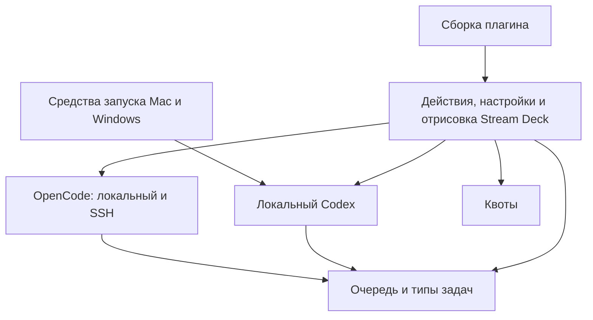
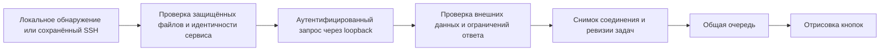
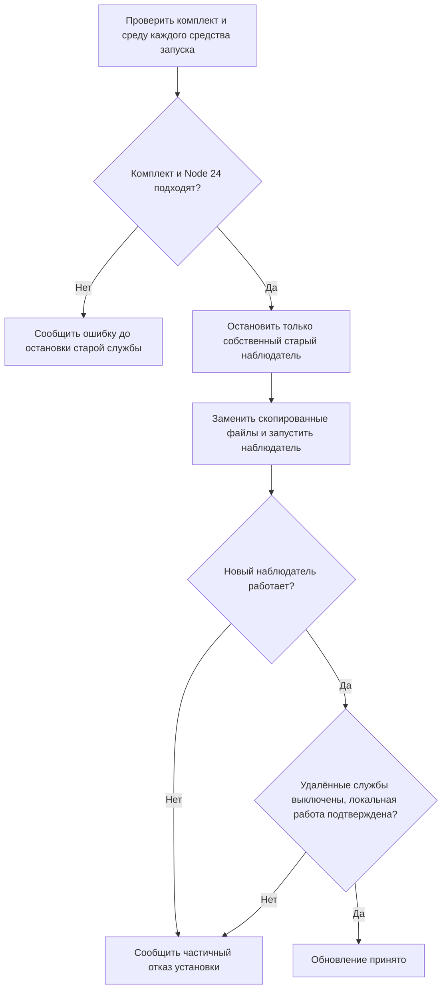
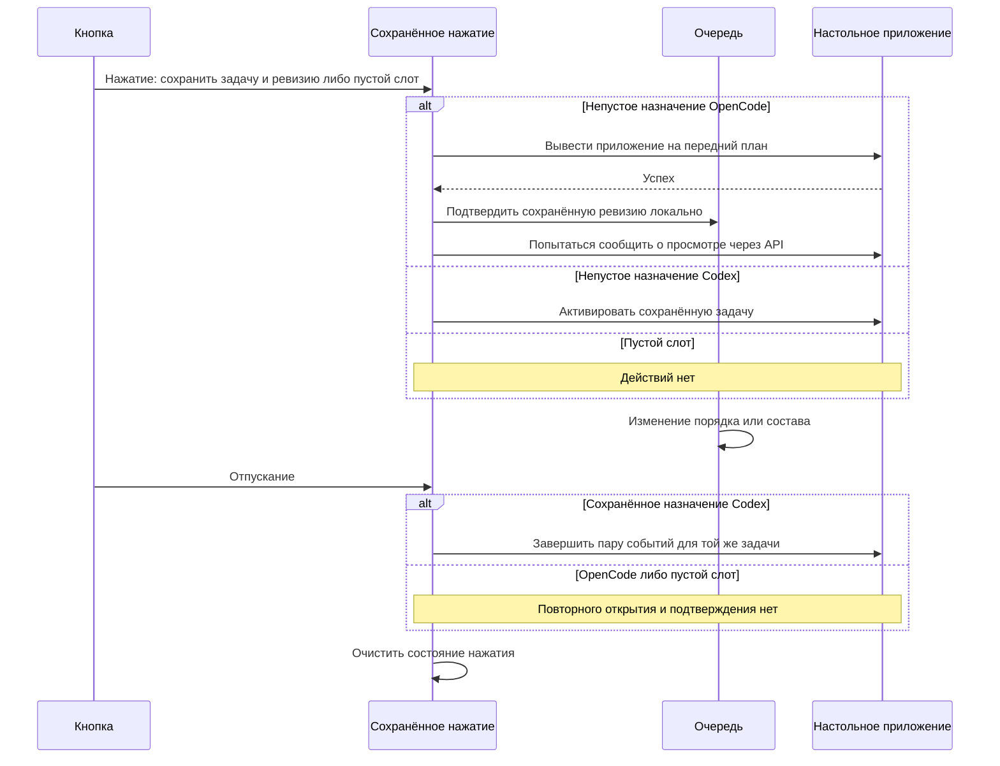

# Обновление и упрощение Codex Deck - Plan

## Goal Capsule

**Цель:** пользователь продолжает работать с чатами Codex и OpenCode с кнопок Stream Deck, а владельцы проекта могут обновлять и развивать нужные функции без сопровождения ненужных приложений и сетевых режимов.

**Способ:** последовательное обновление зависимостей, сокращение состава продукта и организация одного пакета по областям ответственности (KTD1–KTD9).

**Полномочия:** этот документ проектирует будущую реализацию. Его создание не запускает обновление пакетов, удаление файлов приложения, установку сборок или публикацию. При отдельном запуске реализации исполнитель выполняет локальные изменения и проверки; работает на `main` согласно `AGENTS.md`. Выпуск версии, отправка изменений и действия с установленными приложениями требуют соответствующего поручения. Владелец проекта принимает результат по Verification Contract.

**Иерархия:** явные решения пользователя → Product Contract → применимые инструкции репозитория → Planning Contract → отдельные U-ID. Старое требование сохранять Codex relay и iOS в инструкциях заменяется в U1 согласно R1–R4; остальные ограничения безопасности продолжают действовать.

**Остановка:** исполнитель сообщает блокер, если сохранение согласованных пользовательских сценариев невозможно, требуется изменить продуктовый контракт или расширить полномочия. Недоступную проверку на другом компьютере отмечает отдельно и не подменяет сборкой.

## Product Contract

### Summary

Обновить поддерживаемые зависимости, оставить необходимые сценарии работы с настольными приложениями и упростить сопровождение плагина. Основной сценарий — Mac со Stream Deck и чаты OpenCode с Mac и Fedora. Windows сохраняет самостоятельную работу с Codex. Приложение для iPhone и отдельный обмен между экземплярами Codex выводятся из продукта.

### Problem Frame

Проект вырос из форка и содержит несколько независимых сценариев подключения, смешанных в контроллере, средствах запуска и тестах. Поддержка мобильного приложения и отдельного сетевого обмена требует кода и зависимостей, которыми владелец не пользуется. Общие локальные функции при этом находятся в файлах с названием удаляемого протокола, поэтому удаление по названиям опасно.

### Согласованные решения

- **Mac и Fedora — основа; Windows — сопровождение существующих функций.** `Governs R1, R2`. `(session-settled: user-directed — chosen over равное развитие всех платформ: пользователь выбрал основные рабочие компьютеры)`.
- **Сохранить OpenCode через SSH; удалить отдельный Codex relay.** `Governs R2, R4`. `(session-settled: user-approved — chosen over сохранение обоих сетевых механизмов: нужны чаты OpenCode с Fedora, отдельный обмен Codex не нужен)`.
- **Удалить весь мобильный контур.** `Governs R3`. `(session-settled: user-directed — chosen over сохранение приложения и его инфраструктуры: отдельное приложение на iPhone не используется)`.

### Requirements

#### Состав продукта

- R1. Mac — основная платформа плагина; самостоятельный Windows сохраняет установку, запуск и существующие действия без обязательного Mac и без развития новых функций.
- R2. На Mac сохраняются режимы `Codex`, `OpenCode`, `Both`, сбор локальных чатов OpenCode и чатов Fedora через уже сохранённые SSH-подключения. Fedora выступает источником чатов, а не новой платформой плагина Stream Deck.
- R3. Приложение iPhone, проект Xcode, мобильные серверы, обнаружение в сети, сопряжение, команды настройки, документация установки и эксклюзивные зависимости удаляются из поддерживаемого продукта и новых сборок.
- R4. Отдельный Codex relay между компьютерами, его выбор удалённого хоста, сетевые службы, команды настройки и туннели удаляются; независимое SSH-подключение OpenCode из R2 сохраняется.
- R5. Остальные существующие функции получают явный статус «развиваем», «сопровождаем» или «удаляем» с обоснованием по фактическому использованию и связям в коде. Новые удаления сверх R3–R4 требуют отдельного решения пользователя.

#### Сохранение поведения и данных

- R6. Обновление сохраняет назначения кнопок, UUID действий, пользовательские настройки и значки, локальную идентичность хоста и сохранённые подключения OpenCode. Старый удалённый выбор Codex игнорируется: локальная работа не требует повторного сопряжения. Частные файлы старых подключений и токены не удаляются автоматически.
- R7. Существующее действие `com.xonika9.codex-deck.host-toggle` остаётся зарегистрированным для старых профилей; показывает состояние локального подключения и безопасно реагирует на нажатие без выбора удалённого компьютера.
- R8. Сохраняются локальные очередь и каталог Codex, различие собственных и дочерних сессий, порядок по началу работы, подтверждение завершения и корректное действие кнопки при изменении очереди между нажатием и отпусканием.
- R9. Нажатие задачи OpenCode продолжает выводить приложение на передний план и подтверждать показанную ревизию локально. В пределах жизни текущего сборщика неудача уведомления API не возвращает эту ревизию в очередь; новая ревизия завершения появляется снова. После пересоздания сборщика недавний непросмотренный результат может появиться повторно; постоянное хранение подтверждений не добавляется. Выбор конкретного чата в окне OpenCode не добавляется этим планом.
- R10. Сохраняются показ квот, темы, настройки очереди и удержание кнопок; проверка сброса лимитов не расходует реальные кредиты.

#### Сопровождение и безопасность

- R11. Все прямые зависимости обновляются до актуальных стабильных совместимых версий до удаления функциональности. Исключения по совместимости имеют конкретную причину; состав зависимостей после удаления соответствует оставшемуся продукту.
- R12. Упрощение кода сохраняет поведение R6–R10 и уменьшает смешение обязанностей; новые технологии вводятся под найденную задачу, а не ради совпадения с универсальной памяткой стека.
- R13. Локальный интерфейс Chrome DevTools остаётся на loopback. Сбор OpenCode сохраняет аутентификацию, проверку локальной идентичности сервиса и защищённых файлов до отправки секрета. Нет новых сетевых интерфейсов, обходов через горячие клавиши или чтения базы задач.
- R14. Проверки воспроизводимы из чистой установки зависимостей. Автоматические проверки, проверки запущенных приложений и проверки физического Stream Deck описываются раздельно; документация отражает действительный состав и ограничения продукта.

### Примеры приёмки

- AE1. `Covers R2, R9`: Mac получает локальные чаты и чаты Fedora из сохранённого SSH-подключения. Потеря Fedora не прекращает показ локального источника; восстановление связи не создаёт задним числом старые уведомления о завершении.
- AE2. `Covers R6, R7`: установлен старый профиль с `host-toggle` и удалённым выбором Codex. После обновления остальные кнопки работают локально, старая кнопка не теряет UUID; частные настройки остаются на диске.
- AE3. `Covers R8`: пользователь нажал задачу A; до отпускания первой стала B. Открывается A. Если на момент нажатия слот был пуст, появившаяся B по отпусканию не открывается.
- AE4. `Covers R8`: пустой авторитетный каталог отличается от недоступного каталога; дочерняя сессия не заменяет родительскую карточку, обновление снимка не меняет порядок начала работы.
- AE5. `Covers R9`: завершение OpenCode подтверждено локально, уведомление API завершилось ошибкой. Карточка остаётся подтверждённой; следующее завершение с иной ревизией снова видимо.
- AE6. `Covers R1, R14`: Windows без Mac устанавливается и запускает локальную интеграцию Codex; в результатах приёмки явно видно, проверялся ли запуск на Windows и физическое устройство.

### Границы

R1–R14 задают объём этой работы. Переход на Bun, новый веб-интерфейс, React/Vite, сервер Hono, база данных, Docker, новая система маршрутизации и полная смена средств тестирования не входят в план. Связь с исходным форком сохраняется как история происхождения; обратная синхронизация с ним не определяет архитектуру нашего проекта.

## Planning Contract

### Технические решения

- KTD1. Обновление SDK отделить от остальных пакетов: сначала `@elgato/streamdeck` 3, `@elgato/cli` и согласованные manifest/сборка/средства запуска, затем TypeScript и остальные зависимости. Это даёт понятную причину возможной регрессии и выполняет R11 до удаления функций. Источники: [переход на SDK 3](https://docs.elgato.com/streamdeck/sdk/releases/upgrading/v3/), [среда плагина](https://docs.elgato.com/streamdeck/sdk/introduction/plugin-environment/).
- KTD2. Единая целевая среда — Node.js 24, SDKVersion 3, минимальная версия Stream Deck 7.1, соответствующий `target` сборки и новейшие типы Node в ветке 24. Инструменты и CI также используют Node 24. Новейшая ветка `@types/node` 26 не описывает выбранную среду; её не брать только ради номера. Источник: [manifest](https://docs.elgato.com/streamdeck/sdk/references/manifest/). Это осознанное повышение минимума установленного Stream Deck; текущая проверенная на Mac версия 7.6.0 удовлетворяет ему, версию Windows проверить при приёмке.
- KTD3. Сохранить `npm`, `package-lock.json`, `npm ci`, ESM, `esbuild`, `tsx` и `node:test`; перейти на стабильный TypeScript 7 без промежуточного preview-компилятора. Проверка типов покрывает `src`, TypeScript-средства запуска и скрипты, тесты; конфигурация корня не должна исключать их. Старый TypeScript Compiler API не использовать для собственных проверок: [в TypeScript 7 он удалён](https://devblogs.microsoft.com/typescript/announcing-typescript-7-0/). Компиляция типов и преобразование кода сборщиком проверяются отдельно: [esbuild](https://esbuild.github.io/content-types/#typescript), [tsx](https://tsx.is/typescript).
- KTD4. Сначала выделить локальные типы снимка, индекса активности, идентичности задачи и временных меток из `src/relay-protocol.ts`; лишь затем удалить транспортный протокол и смешивание удалённых хостов. Защита R8 важнее названия файла. После выделения общая очередь не импортирует транспорт или Elgato SDK.
- KTD5. Разделение кода выполняется внутри одного пакета. Области `codex`, `opencode`, `agents`, `stream-deck`, `usage` имеют публичный `index.ts`; сборка зависимостей остаётся в `src/plugin.ts`. Низкоуровневые общие функции выделяются только при нескольких действительных потребителях. Полная монорепозиторная структура `apps/web`/`apps/api` здесь не решает задачу R12.
- KTD6. Старые приватные настройки из R6 не мигрировать разрушительно. Все локальные пути выбора/исполнения действия обходят старый remote target. Существующая метка службы `com.simeo.codex-deck.watcher` сохраняется; обновление выполняется штатным установщиком с заменой скопированного средства запуска и остановкой только принадлежащего ему старого процесса. Посторонние SSH-туннели и OpenCode не трогать. Комплект и Node 24 для каждого запускаемого пути проверяются до остановки старой собственной службы; завершением установки считать работоспособный новый watcher, а не только регистрацию службы. Частичный отказ сообщается явно без возобновления удалённых слушателей.
- KTD7. После сокращения продукта подключить Biome для поддерживаемых TypeScript/JavaScript/JSON-файлов и автоматический контроль направлений импортов/циклов. Форматирование выделить из изменений поведения. HTML/SVG, Markdown и YAML не считать полностью проверенными Biome; генерируемые файлы исключить. Ввод Zod и смену тестового раннера не делать заранее: сначала проверить, осталась ли конкретная повторяющаяся задача проверки внешних данных. Источник: [релизы Biome](https://github.com/biomejs/biome/releases).
- KTD8. Тесты удалять по покрываемой функции, а не по имени файла. Локальные сценарии из `test/relay.test.ts` и `test/ios-project.test.ts` переносить в профильные проверки до удаления. Новые тесты проверяют наблюдаемое поведение из R/AE, а не повторяют устройство кода или строки его исходника. Существующие проверки упаковки и ограничения безопасности сохраняются, когда они защищают реальный контракт.

- KTD9. Для автоматических границ использовать собственный граф Biome: `noImportCycles` с проверкой типовых импортов и `noRestrictedImports` с правилами для каждой области. Межобластные переходы — через точные имена `#codex`, `#opencode`, `#agents`, `#stream-deck`, `#usage` в `package.json.imports`, отображённые на публичные `index.ts`; внутренние относительные импорты остаются внутри владельца. Обходные относительные пути и абсолютные пути запрещены. Вычисляемые аргументы `import()`/`require()` в коде областей отклоняет небольшое структурное правило Biome на GritQL: обычное правило ограничений распознаёт только строковые имена. Нужные загрузки модулей внешнего приложения имеют точечные обоснованные исключения; вся область Codex не исключается. Проверку разрешения выполнять в TypeScript, tsx, esbuild и собранном пакете. Это позволяет обойтись без старого Compiler API и отдельного архитектурного пакета. Источники: [циклы](https://biomejs.dev/linter/rules/no-import-cycles/javascript/), [ограничения импортов](https://biomejs.dev/linter/rules/no-restricted-imports/javascript/), [структурные правила Biome](https://biomejs.dev/linter/plugins/), [внутренние имена Node](https://nodejs.org/api/packages.html#subpath-imports).

### Снимок зависимостей

Стабильные версии сверены 2026-10-05. При начале реализации заново проверить registry и требования совместимости; таблица задаёт исходную оценку, а не разрешение установить устаревшую на тот момент версию.

| Пакет | Сейчас | Проверенная версия | Назначение в плане |
|---|---|---|---|
| `@elgato/streamdeck` | 2.1.0 | 3.0.1 | U1 |
| `@elgato/cli` | 1.7.4 | 1.10.1 | U1 |
| `typescript` | 5.9.3 | 7.0.2 | U2 |
| `ws` | 8.21.1 | 8.22.0 | U2; остаётся для локального DevTools |
| `esbuild` | 0.28.1 | 0.28.2 | U2 |
| `tsx` | 4.23.1 | 4.23.15 | U2 |
| `@types/node` | 24.13.3 | последняя 24.x | U2, по KTD2 |
| `@types/ws` | 8.18.1 | 8.18.2 | U2; остаётся вместе с `ws` |
| `bonjour-service` | 1.4.3 | 1.4.4 | U2, затем удаление в U3 |
| `qrcode` / `@types/qrcode` | 1.5.4 / 1.5.6 | 1.5.4 / 1.5.6 | U2 без изменения версии, затем удаление в U3 |
| `selfsigned` | 5.5.0 | 5.5.0 | U2 без изменения версии, затем удаление в U3 |

Совпадение актуальной и установленной версии также является результатом проверки. Транзитивные зависимости обновляются через совместимый пересчёт lockfile, без принудительного обхода ограничений прямых пакетов.

### Архитектура после сокращения

Схема фиксирует направления зависимостей, а не количество файлов. `src/plugin.ts` собирает компоненты; средства запуска используют публичный вход локального Codex и не запускают плагин побочным импортом.



`codex` и `opencode` не импортируют друг друга. `agents` содержит правила очереди без процессов, сетевого транспорта и SDK. Общий каталог `runtime` допустим для оставшихся действительно общих функций путей и локальной идентичности; не превращать его в склад вспомогательных функций.

Ожидаемая структура по KTD5; список файлов каждого U-ID определяет конкретные переносы:

```text
src/
  plugin.ts
  codex/index.ts
  opencode/index.ts
  agents/index.ts
  stream-deck/index.ts
  usage/index.ts
launcher/
  macos/
scripts/
test/
docs/
  maintenance/
```

Матрица сохраняемых режимов по `src/task-source.ts` (R1–R2, R8). Колонка Windows фиксирует отсутствие нового сборщика OpenCode, а не обещание новых режимов интерфейса:

| Выбранный источник | Сбор OpenCode на Mac | Сбор OpenCode на Windows | Активная очередь |
|---|---|---|---|
| `Codex` | Нет | Нет | Сохранённое предпочтение пользователя |
| `OpenCode` | Да | Нет | Включена; предпочтение Codex сохранено |
| `Both` | Да | Нет | Включена; предпочтение Codex сохранено |

Сохраняемая граница данных OpenCode (R13); отказ одного подключения изолируется его существующим обработчиком:



Схема приёмки переустановки по KTD6, без новой системы обновлений:



Сохранённый жизненный цикл кнопки (R8–R9):



Схема сохраняет фазы действия, а не задаёт новое поведение источникам (R8–R9). Для OpenCode сетевой вызов подтверждения может не удаться; локальное подтверждение уже записано. Codex завершает пару согласно существующему пути локального моста; для прямого выбора из каталога отпускание не добавляет нового действия. Удержание отдельной кнопки сброса проверяется без расходования квоты (R10).

### Влияние на систему и риски

| Область | Последствие | Решение |
|---|---|---|
| SDK 3 | Получение настроек больше не порождает событие их изменения; типы действий стали шире | U1 явно загружает начальные настройки и сужает тип клавиш; не рассчитывать на побочный вызов обработчика |
| TypeScript 7 | Нативный компилятор и платформенные зависимости | U2 проверяет чистый `npm ci` отдельно на Mac и Windows; не переносить `node_modules` между ОС |
| Удаление протокола | Внутри находятся локальные данные очереди | KTD4, AE3–AE4; `ws` и Windows-зависимость упаковки не удаляются с relay |
| Старые установки | Средства запуска скопированы за пределы репозитория | KTD6; проверка обновления установленного экземпляра в U8, сборка сама его не заменяет |
| Частные данные | Старые файлы всё ещё содержат токены и адреса | R6, R13; запрет их попадания в пакет остаётся в `scripts/audit-release.mjs` |
| Внешние приложения | Внутренние интерфейсы Codex/OpenCode могут измениться | Совместимость фиксировать по проверенной версии; при несовместимости безопасная ошибка, не новый обход |
| Инструменты обновления | Полный changelog CLI 1.10.1 не найден в опубликованном changelog | Не выводить совместимость из отсутствия записи; U1 подтверждает её проверкой manifest, сборки и упаковки |

Код OpenCode уже ограничивает объём ответа, время ожидания и срок актуальности завершения; эти ограничения переносить вместе с их потребителями, не заменять общей схемой JSON. Контекст агента, новые инструменты MCP, универсальный API действий и управление чужими чатами не добавляются: план сохраняет существующие действия UI и их полномочия.

### Порядок

`U1 → U2 → U3 → U4 → U5 → U6 → U7 → U8`. Это намеренно последовательная миграция: сначала обновляем весь существующий пакет, затем уменьшаем поверхность и только потом меняем устройство кода. Проверки каждого этапа дают основание двигаться дальше; успешный неизменённый этап не проверять многократно без новой причины.

## Implementation Units

### U1. Обновить SDK и согласовать среду запуска

**Цель:** текущий состав функций работает на поддерживаемом SDK. **Требования:** R1, R11, R14; KTD1–KTD2. **Зависимости:** нет.

**Файлы:** `package.json`, `package-lock.json`, `src/actions.ts`, `src/plugin.ts`, `src/controller.ts`, `static/manifest.json`, `scripts/build.mjs`, `scripts/build-launcher.mjs`, `.github/workflows/ci.yml`, `AGENTS.md`, `CONTRIBUTING.md`, `CLAUDE.md`.

**Подход:** сначала зафиксировать фактическое состояние существующих проверок. Обновить SDK и CLI; согласовать требования Node/Stream Deck и сборку. Исправить изменённую типизацию без широких приведения к `any`. Проверить generic-настройки, разделение клавиш и других действий, исходную загрузку настроек и события редактора настроек. В инструкциях обозначить R1–R4 как новое направление, сохранив остальные правила.

**Сценарии:** первый запуск получает сохранённые настройки без ожидания события SDK; изменение в редакторе обновляет действие; неподдерживаемый вид действия не попадает в обработчик клавиши; Mac и Windows сборки используют выбранную среду.

**Проверка:** команды Verification Contract проходят; manifest и упакованный плагин согласованы с KTD2. Существующие провалы отделены от регрессий обновления и устранены либо обозначены как блокер.

### U2. Обновить остальные пакеты и полную проверку типов

**Цель:** зависимости и конфигурация компиляции соответствуют актуальной поддерживаемой среде. **Требования:** R11, R14; KTD3. **Зависимости:** U1.

**Файлы:** `package.json`, `package-lock.json`, `tsconfig.json`, конфигурация сборки в `scripts/`, TypeScript-файлы `src/`, `test/`, `launcher/macos/`, `launcher/mobile-pairing-cli.ts`, `scripts/*.ts`.

**Подход:** повторно сверить версии и engines. Обновить весь текущий состав, включая пока ещё существующие мобильные зависимости. Настроить TypeScript 7; проверить ранее исключённые из типов исполняемые файлы. Не обходить ошибки через отключение проверки целых каталогов или сохранение старого компилятора ради собственного API.

**Сценарии:** чистая установка на каждой поддерживаемой ОС; загрузка ESM-средств запуска; сборщик корректно обрабатывает декораторы SDK; локальный WebSocket DevTools работает после обновления `ws`; строгая проверка обнаруживает ошибку в средстве запуска вне `src`.

**Проверка:** полный набор из Verification Contract, список версий и мотивированных исключений. Только после этого удаляются ненужные пакеты в U3.

### U3. Удалить приложение iPhone и его инфраструктуру

**Цель:** новые сборки содержат только настольные сценарии. **Требования:** R3, R6, R8, R10, R14; KTD8. **Зависимости:** U2.

**Файлы:** `ios/`, мобильные участки `src/codex-relay-server.ts`, `src/codex-relay-client.ts`, `src/controller.ts`, `src/mobile-local-pairing.ts`, `launcher/mobile-pairing-cli.ts`, `launcher/Configure-CodexDeckMobile.ps1`, мобильные участки `launcher/macos/codex-deck-macos.ts` и `launcher/Start-CodexDeck.ps1`, `scripts/build-launcher.mjs`, `scripts/configure-ios-signing.sh`, `test/ios-project.test.ts`, `test/micro-bridge.test.ts`, `test/release-docs.test.ts`, `.gitignore`, `package.json`, `package-lock.json`.

**Подход:** сначала перенести desktop-проверки кольца контекста и настройки активной очереди из iOS-тестов. Отделить сценарии нажатий от проверок мобильного снимка в смешанных тестах. Удалить мобильные серверы, обработчики, CLI, ресурсы упаковки и пакеты `bonjour-service`, `qrcode`, `selfsigned`, `@types/qrcode` после проверки эксклюзивных потребителей. Удалить действующие мобильные руководства, а исторические заметки оставить историческими.

**Сценарии:** локальные нажатия и квоты сохраняются без мобильного клиента; настольное средство запуска не создаёт мобильный listener; сборка не содержит Xcode-проекта, команд сопряжения и мобильных зависимостей.

**Проверка:** сохранённые desktop-тесты проходят; manifest/пакеты не имеют активных ссылок на удалённую функциональность. История и запреты на упаковку приватных файлов не считаются ошибочными остатками.

### U4. Удалить отдельный Codex relay и сохранить старые профили

**Цель:** Codex работает локально без отдельного режима обмена; OpenCode с Fedora продолжает работать. **Требования:** R2, R4, R6–R10, R13; KTD4, KTD6, KTD8. **Зависимости:** U3.

**Файлы:** `src/relay-protocol.ts`, `src/codex-relay-client.ts`, `src/codex-relay-server.ts`, `src/relay-network.ts`, `src/active-queue.ts`, `src/session-ownership.ts`, `src/controller.ts`, `src/control-target.ts`, `src/actions.ts`, `src/plugin.ts`, manifest, `launcher/macos/codex-deck-macos.ts`, `launcher/start-codex-deck.sh`, `launcher/Watch-CodexDeck.ps1`, `launcher/Configure-CodexDeckRelay.ps1`, `launcher/Start-CodexDeck.ps1`, `scripts/build-launcher.mjs`, `scripts/relay-smoke.ts`, `test/relay.test.ts`, `test/usage.test.ts`, `test/macos-launcher.test.ts` и связанные существующие тесты.

**Подход:** выполнить KTD4 и сохранить полную локальную модель очереди. Перенести проверки локальных шести слотов, каталога/владения, настроек, квот и OpenCode из смешанного relay-набора. Затем удалить сетевые потребители и команды; заменить `host-toggle` поведением R7 и обработать старые настройки согласно R6. Windows-упаковка продолжает включать `ws`. SSH-процессы OpenCode остаются у своего владельца.

**Сценарии:** AE1–AE5; несколько старых remote target настроек дают локальное исполнение; самостоятельный Windows не ждёт сервер Mac; отсутствие/пустота каталога различаются; родительская задача и дочерние события сохраняют назначение карточки; поздний ответ источника не подтверждает другую ревизию. Исчезновение кнопки при удержании и второй экземпляр того же номера не могут отпустить или подтвердить чужую задачу; при обнаружении нарушения ограничить исправление привязкой состояния к контексту действия.

**Проверка:** локальные сценарии существуют вне удаляемых файлов и проходят. Средства запуска больше не открывают Codex relay; OpenCode туннель остаётся loopback. Старый профиль имеет все ранее зарегистрированные UUID и понятный результат `host-toggle`.

### U5. Провести аудит оставшихся функций и кода

**Цель:** последующее упрощение имеет доказанные цели и ограниченный объём. **Требования:** R5, R12; KTD5, KTD8. **Зависимости:** U4.

**Файлы:** оставшийся `src/`, `launcher/`, `scripts/`, `test/`; результаты в `docs/maintenance/feature-scope.md` и `docs/maintenance/code-audit.md`.

**Подход:** составить инвентаризацию пользовательских функций по точкам входа, настройкам, ресурсам и тестам. Зафиксировать их статус по R5. Проверить ошибки, дублирование, смешение обязанностей и ветви без действительных потребителей с помощью применимых `ce-code-review` и последующей `ce-simplify-code`. Аудит охватывает код целиком, а упрощение — только найденные проблемы. Результат содержит источник, последствие, выбранную правку и проверку; не использовать количество строк как цель.

**Сценарии:** новых тестов для отчёта не нужно. Каждое предлагаемое изменение поведения отделено от безопасного упрощения; Windows поддержка, OpenCode SSH, квоты и историческая совместимость явно классифицированы.

**Проверка:** нет необоснованных удалений сверх R3–R4; для U6 есть список конкретных правок и сохраняемых контрактов. Существенные находки, требующие иного продукта, остаются отдельным предложением.

### U6. Разделить обязанности и упростить оставшийся код

**Цель:** изменения в одном источнике задач не требуют вмешательства в другой и в отрисовку кнопок. **Требования:** R8–R13; KTD4–KTD5. **Зависимости:** U5.

**Файлы:** `src/controller.ts`, `src/task-source.ts`, `src/active-queue.ts`, `src/types.ts`, `src/codex-micro-renderer-bridge.ts`, `src/codex-sidebar.ts`, `src/codex-active-catalog-expression.ts`, `src/session-ownership.ts`, `launcher/runtime-override.ts`, `src/opencode/collector.ts`, `src/opencode-open.ts`, `src/opencode/secure-files.ts`, `src/usage.ts`, средства запуска; целевые публичные входы `src/{codex,opencode,agents,stream-deck,usage}/index.ts`; профильные тесты.

**Подход:** переносить по одной области с сохранением публичного поведения. Контроллер оставляет координацию событий SDK, настройку действий и отрисовку; источники отвечают за получение и открытие задач, очередь — за выбор/порядок/подтверждение. Коллектор OpenCode разделить по обнаружению, SSH, аутентифицированному клиенту и состоянию лишь там, где аудит подтвердил самостоятельную обязанность. Не заводить общий контейнер зависимостей или новый универсальный API. Применить проверенные правки U5; упростить изменённый код через `ce-simplify-code`.

**Сценарии:** AE1–AE5; режимы `OpenCode`/`Both` временно выбирают активную очередь, не уничтожая сохранённое предпочтение Codex; ошибки одного источника изолированы; секрет не отправляется непроверенному сервису; поздний ответ прежнего соединения не перезаписывает актуальное состояние; квоты доступны по прежним условиям.

**Проверка:** сохранены сценарии и ограничения данных, импорт запуска не регистрирует действий плагина, направления соответствуют схеме. Сборка и проверки проходят после каждой завершённой области без массовой правки ожидаемых результатов под реализацию.

### U7. Добавить проверки качества и границ модулей

**Цель:** нарушения новых границ обнаруживаются автоматически. **Требования:** R12–R14; KTD3, KTD7–KTD9. **Зависимости:** U6.

**Файлы:** `package.json`, `package-lock.json`, новая конфигурация Biome, `scripts/lint/no-computed-imports.grit`, `tsconfig.json`, `.github/workflows/ci.yml`, поддерживаемые исходники и тесты.

**Подход:** внедрить KTD7 и KTD9 в оставшийся состав. Запретить циклы, зависимость источников задач от слоя действий, настроек и отрисовки Stream Deck, взаимный импорт Codex/OpenCode и обход `index.ts`. Добавить CI на Mac рядом с Windows, закрепить выбранные версии инструментов. Сначала обеспечить проверку, затем отдельной правкой применить механическое форматирование. Не маскировать содержательные ошибки широким исключением каталога.

**Сценарии:** прямой импорт внутреннего файла, обход через `./../`, реэкспорт, типовой импорт в запрещённом направлении и импорт с вычисляемым именем отклоняются; циклы из двух/трёх модулей, включая типовые, отклоняются; разрешённый публичный вход, внутренний импорт и необходимое точечное исключение проходят. Эту пробу выполнить как проверку инструмента и убрать временные нарушения; не добавлять тест, копирующий конфигурацию линтера.

**Проверка:** CI выполняет форматирование/статический анализ, границы, типы, существующие тесты и сборку/manifest. Генерируемые и чужие ресурсы не форматируются; шаблоны встроенного JavaScript остаются покрыты своими проверками поведения.

### U8. Обновить документацию и проверить обновление установленного плагина

**Цель:** пользователь может поставить актуальную сборку и понять поддерживаемый состав. **Требования:** R1–R14; KTD6, KTD8. **Зависимости:** U7.

**Файлы:** `README.md`, `README.ru.md`, `SECURITY.md`, `CONTRIBUTING.md`, `AGENTS.md`, `CLAUDE.md`, `launcher/README.txt`, `docs/ARCHITECTURE.md`, `docs/MACOS.md`, `docs/WINDOWS.md`, `docs/TROUBLESHOOTING.md`, `docs/MULTI_HOST.md`, `docs/IOS*.md`, `scripts/build-launcher.mjs`, `scripts/audit-release.mjs`, `scripts/prepare-release.mjs`, `test/release-docs.test.ts`, тесты упаковки/средств запуска.

**Подход:** привести действующие руководства, описания пакета и совместимость в соответствие R1–R14. Исторические планы/CHANGELOG не переписывать как текущее обещание. Проверить копирование документации в launcher bundles: удалённые действующие руководства не попадают в пакет. Сохранить запреты на приватные файлы старого relay/mobile. На разрешённой тестовой установке провести обновление старого профиля и скопированного watcher по KTD6; проверить фактическое отсутствие принадлежащих ему удалённых служб после обновления. Подготовить локальные артефакты и результат приёмки, не публиковать без поручения.

**Сценарии:** AE2 и AE6; Mac с локальным Codex, Mac с локальным и Fedora OpenCode, отключение/восстановление Fedora; Windows без Mac; старый watcher заменён и новый реально работает на Node 24; отсутствующая подходящая среда обнаружена до остановки старой службы, частичный отказ установки обозначен ошибкой; OpenCode-туннель не остановлен; физические нажатия/удержания и изменение очереди соответствуют AE3.

**Проверка:** выполнен Verification Contract с раздельным отчётом. Старые секреты не попали в артефакты; сборки не содержат удалённые приложения/службы. Непроверенная платформа или физическое устройство явно остаются непроверенными, а не получают отметку по CI.

## Verification Contract

Проверки ниже относятся к будущей реализации. Написание этого плана не требует установки зависимостей, сборки или запуска тестов.

**Автоматические проверки:** начать реализацию с `npm ci`, `npm run check`, `npm test`, `npm run validate` и сохранить результат исходного состояния. Для изменённого кода повторять соответствующие обязательные команды `AGENTS.md`. После U7 добавить `npm run lint` и `npm run check:boundaries` в единый обязательный набор. Выполнить чистую установку и набор в CI на Mac и Windows с Node 24. Пропуски PowerShell-проверок на Mac не являются проверкой Windows.

**Упаковка:** в U8 выполнить `npm run pack` и `npm run release:prepare` для локальных артефактов, затем `npm run audit:release`. Проверить содержимое плагина и launcher bundles, manifest, зависимости и контрольные суммы. Не коммитить/распространять сгенерированные пакеты и частные данные. Остаточные строки проверять по действующим точкам входа, сборке и документации; исторические файлы и защитные запреты могут упоминать удалённые функции.

**Запущенные приложения:** отдельно записать ОС и версии Codex/OpenCode/Stream Deck, проверенные сценарии и исходы. Mac: Codex; OpenCode локально и через Fedora SSH; `Both`; очередь, квоты, отключение источника, старые настройки. Windows: самостоятельная локальная работа, средство запуска и совместимость старого профиля. Проверка Fedora относится к настоящему источнику чатов, не к новой сборке плагина для Linux.

**Физическое устройство:** отдельно проверить реальный Stream Deck и записать модель: сохранённый профиль, обычные нажатия, пустой слот, изменение очереди при удержании, настройки и отображение квот. Сброс квоты проверять подменой исполнительного действия или безопасным коротким нажатием; реального расхода кредитов не допускает R10. Автоматический тест удержания не объявлять проверкой физической кнопки.

**Безопасность:** сохранить проверки loopback, защищённых файлов, ограничения тела/таймаута, проверки идентичности до отправки секрета, закрытого отказа и исключения приватных данных из релиза. Не писать адреса SSH, токены, содержимое чатов и личные пути в результаты проверки.

## Definition of Done

Каждый U-ID завершён, когда выполнена его проверка, отсутствуют необъяснённые регрессии и сохранена трассировка к требованиям. Прогресс исполнения хранится вне плана.

Работа в целом завершена, когда R1–R14 подтверждены, новые сборки содержат только согласованный продукт, проходят все обязательные автоматические проверки и аудит упаковки, а документация позволяет воспроизвести запуск. В отчёте указан результат приёмки приложений и физического устройства по Verification Contract. Если нужная среда недоступна, код можно передать на проверку, но общая приёмка остаётся незавершённой до соответствующего наблюдаемого результата.

Из итогового изменения удалены промежуточный экспериментальный код, временные нарушения импортов и неиспользуемые ресурсы. Пользовательские изменения сохранены. Секреты, сторонние проприетарные ресурсы и собранные релизные пакеты отсутствуют в отслеживаемом изменении. Публикация и отдельные продуктовые удаления не считаются автоматически порученными этим планом.

## Appendix

### Опорные участки текущего кода

- `src/relay-protocol.ts`: `HostSnapshot`, `HostActivityIndex`, `validTimestamp`, `threadIdentity`; данные локальных потребителей нельзя удалить вместе с транспортом (KTD4).
- `src/controller.ts`: исходная загрузка настроек, `pressedAgents`, пустые нажатия, выбор источника, локальная очередь и квоты; `src/task-source.ts`: платформенные ограничения OpenCode (R2, R8–R10).
- `src/opencode/collector.ts`, `src/opencode/secure-files.ts`: обнаружение локального сервиса и сохранённых SSH-подключений, владение защищёнными файлами, проверка сервиса и ревизии завершения (R2, R9, R13).
- `src/session-ownership.ts`, `src/active-queue.ts`: структурные признаки владельца сессии, начало работы и порядок; каталог с нулём элементов не равен отсутствию каталога (R8).
- `launcher/macos/codex-deck-macos.ts`, `launcher/Watch-CodexDeck.ps1`: локальный запуск и одновременно удаляемые службы; `scripts/build-launcher.mjs`: копирование launcher и действующих руководств (U3, U4, U8).
- `test/relay.test.ts`: среди тестов транспорта находятся локальная очередь, каталог, владение, квоты и OpenCode; `test/ios-project.test.ts`: содержит desktop-проверки настроек и кольца контекста (KTD8).

Версии пакетов: публичный registry npm; для SDK — [пакет и релизы](https://www.npmjs.com/package/@elgato/streamdeck), для CLI — [пакет](https://www.npmjs.com/package/@elgato/cli) и [опубликованный changelog](https://github.com/elgatosf/streamdeck/blob/main/packages/cli/CHANGELOG.md). Источники выбора среды и TypeScript связаны с KTD1–KTD3; при новом запуске их актуальность проверяется заново.
